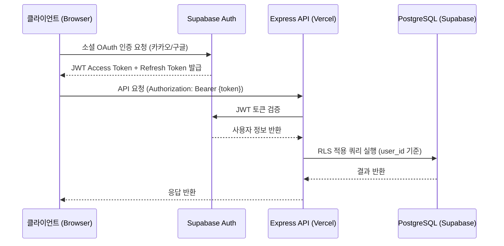

# API 스펙

**프로젝트명**: 반려동물 건강 기록 웹앱
**작성일**: 2026-06-19
**버전**: v1.0
**참조 문서**: 기능명세서.md, 요구사항정의서.md

---

## 1. 개요

### 1.1 기본 정보

| 항목 | 내용 |
|------|------|
| Base URL | `https://api.petlog.app/v1` |
| API 버전 | v1.0 |
| 프로토콜 | HTTPS (전 구간 암호화, NFR-013) |
| 데이터 형식 | JSON (Content-Type: application/json) |
| 인증 방식 | Supabase Auth / JWT Bearer Token |
| 토큰 만료 | Access Token: 7일 / Refresh Token: Supabase 기본값 |

### 1.2 인증 방식

인증이 필요한 모든 API 요청은 HTTP Authorization 헤더에 Bearer Token을 포함해야 합니다.

```
Authorization: Bearer {access_token}
```

- 토큰은 소셜 로그인(카카오 / 구글) 성공 시 Supabase Auth가 발급합니다.
- Access Token 만료 시 Supabase Auth가 Refresh Token을 사용하여 자동 갱신합니다.
- Row-Level Security(RLS)가 적용되어 있으므로, 인증된 사용자는 자신의 데이터만 접근 가능합니다.

### 1.3 공통 요청 헤더

| 헤더 | 필수 여부 | 설명 |
|------|-----------|------|
| `Content-Type` | 필수 (POST, PATCH) | `application/json` |
| `Authorization` | 인증 필요 API 필수 | `Bearer {access_token}` |
| `Accept` | 선택 | `application/json` |

### 1.4 공통 응답 포맷

#### 성공 응답

```json
{
  "success": true,
  "data": { },
  "message": "요청이 처리되었습니다."
}
```

#### 실패 응답

```json
{
  "success": false,
  "error": {
    "code": "ERROR_CODE",
    "message": "오류 설명 메시지",
    "details": { }
  }
}
```

---

## 2. 에러 코드 정의

| 에러 코드 | HTTP 상태 | 설명 |
|-----------|-----------|------|
| `AUTH_REQUIRED` | 401 | Authorization 헤더가 없거나 토큰이 유효하지 않습니다. |
| `TOKEN_EXPIRED` | 401 | Access Token이 만료되었습니다. Refresh Token으로 재발급하세요. |
| `FORBIDDEN` | 403 | 해당 리소스에 접근 권한이 없습니다. (RLS 위반 포함) |
| `NOT_FOUND` | 404 | 요청한 리소스를 찾을 수 없습니다. |
| `VALIDATION_ERROR` | 422 | 요청 파라미터 또는 Body 유효성 검사에 실패했습니다. |
| `CONFLICT` | 409 | 이미 존재하는 리소스와 충돌이 발생했습니다. |
| `INTERNAL_SERVER_ERROR` | 500 | 서버 내부 오류가 발생했습니다. |
| `TIMEOUT` | 504 | 서버 응답 시간이 초과되었습니다. |
| `PET_NOT_FOUND` | 404 | 해당 pet_id의 반려동물 프로필을 찾을 수 없습니다. |
| `WEIGHT_NOT_FOUND` | 404 | 해당 날짜의 체중 기록을 찾을 수 없습니다. |
| `WATER_LOG_NOT_FOUND` | 404 | 해당 날짜의 음수량 기록을 찾을 수 없습니다. |
| `REPORT_NOT_FOUND` | 404 | 해당 월의 리포트를 찾을 수 없습니다. |
| `PDF_GENERATION_TIMEOUT` | 504 | PDF 생성 시간이 5초를 초과했습니다. |
| `WEIGHT_OUT_OF_RANGE` | 422 | 체중 값이 허용 범위(0.1~99.9kg)를 벗어났습니다. |
| `WATER_OUT_OF_RANGE` | 422 | 음수량 값이 허용 범위(0~9,999ml)를 벗어났습니다. |
| `PUSH_SUBSCRIPTION_FAILED` | 422 | 푸시 알림 구독 등록에 실패했습니다. |

---

## 3. API 목록

### 3.1 인증 (Authentication)

| 메서드 | 엔드포인트 | 인증 필요 | 설명 | 기능 ID |
|--------|-----------|-----------|------|---------|
| POST | `/api/auth/social` | 불필요 | 소셜 로그인 (Supabase Auth 위임) | F-006 |
| DELETE | `/api/auth/me` | 필요 | 회원 탈퇴 (소프트 삭제) | F-006 |

### 3.2 반려동물 프로필 (Pets)

| 메서드 | 엔드포인트 | 인증 필요 | 설명 | 기능 ID |
|--------|-----------|-----------|------|---------|
| POST | `/api/pets` | 필요 | 반려동물 프로필 등록 | F-001 |
| GET | `/api/pets/:id` | 필요 | 반려동물 프로필 조회 | F-001 |
| PATCH | `/api/pets/:id` | 필요 | 반려동물 프로필 수정 | F-001 |
| DELETE | `/api/pets/:id` | 필요 | 반려동물 프로필 삭제 (관련 기록 CASCADE) | F-001 |

### 3.3 체중 기록 (Weight Logs)

| 메서드 | 엔드포인트 | 인증 필요 | 설명 | 기능 ID |
|--------|-----------|-----------|------|---------|
| POST | `/api/pets/:id/weights` | 필요 | 체중 기록 저장 (Upsert) | F-002 |
| GET | `/api/pets/:id/weights` | 필요 | 기간별 체중 기록 목록 조회 | F-002 |
| PATCH | `/api/pets/:id/weights/:date` | 필요 | 특정 날짜 체중 기록 수정 | F-002 |
| DELETE | `/api/pets/:id/weights/:date` | 필요 | 특정 날짜 체중 기록 삭제 | F-002 |

### 3.4 음수량 기록 (Water Logs)

| 메서드 | 엔드포인트 | 인증 필요 | 설명 | 기능 ID |
|--------|-----------|-----------|------|---------|
| POST | `/api/pets/:id/water-logs` | 필요 | 음수량 기록 저장 (Upsert) | F-003 |
| GET | `/api/pets/:id/water-logs` | 필요 | 기간별 음수량 기록 목록 조회 | F-003 |
| PATCH | `/api/pets/:id/water-logs/:date` | 필요 | 특정 날짜 음수량 기록 수정 | F-003 |

### 3.5 월간 리포트 (Monthly Reports)

| 메서드 | 엔드포인트 | 인증 필요 | 설명 | 기능 ID |
|--------|-----------|-----------|------|---------|
| GET | `/api/pets/:id/reports` | 필요 | 리포트 목록 조회 | F-004 |
| GET | `/api/pets/:id/reports/:year/:month` | 필요 | 특정 월 리포트 상세 조회 | F-004 |
| POST | `/api/pets/:id/reports/export-pdf` | 필요 | 월간 리포트 PDF 생성 및 다운로드 | F-004 |

### 3.6 알림 설정 (Notifications)

| 메서드 | 엔드포인트 | 인증 필요 | 설명 | 기능 ID |
|--------|-----------|-----------|------|---------|
| POST | `/api/notifications/subscribe` | 필요 | 푸시 알림 구독 등록 | F-005 |
| GET | `/api/notifications/settings` | 필요 | 알림 설정 조회 | F-005 |
| PATCH | `/api/notifications/settings` | 필요 | 알림 설정 변경 | F-005 |

---

## 4. API 상세

---

### 4.1 인증 (Authentication)

---

#### POST /api/auth/social — 소셜 로그인

| 항목 | 내용 |
|------|------|
| 설명 | 카카오 또는 구글 소셜 OAuth 인증을 Supabase Auth에 위임하여 처리합니다. 인증 성공 시 JWT Access Token과 Refresh Token을 반환합니다. 신규 사용자는 `users` 테이블에 자동 등록됩니다. |
| HTTP 메서드 | POST |
| URL | `/api/auth/social` |
| 인증 | 불필요 |
| 관련 기능 ID | F-006 |

**Request Body**

| 필드 | 타입 | 필수 | 설명 |
|------|------|------|------|
| `provider` | string | 필수 | 소셜 제공자. 허용 값: `kakao`, `google` |
| `access_token` | string | 필수 | 소셜 OAuth 공급자로부터 받은 Access Token |

```json
{
  "provider": "kakao",
  "access_token": "KAKAO_OAUTH_ACCESS_TOKEN"
}
```

**Response 200 — 로그인 성공**

| 필드 | 타입 | 설명 |
|------|------|------|
| `access_token` | string | Supabase JWT Access Token (만료: 7일) |
| `refresh_token` | string | Supabase Refresh Token |
| `user.id` | string (UUID) | 사용자 ID |
| `user.email` | string | 소셜 계정 이메일 |
| `user.is_new` | boolean | 신규 가입 여부. `true`이면 온보딩 화면으로 이동 |

```json
{
  "success": true,
  "data": {
    "access_token": "eyJhbGciOiJIUzI1NiIsInR5cCI6IkpXVCJ9...",
    "refresh_token": "v1.REFRESH_TOKEN_STRING",
    "user": {
      "id": "a1b2c3d4-e5f6-7890-abcd-ef1234567890",
      "email": "user@example.com",
      "is_new": false
    }
  },
  "message": "로그인에 성공했습니다."
}
```

**Response 422 — 유효성 오류**

```json
{
  "success": false,
  "error": {
    "code": "VALIDATION_ERROR",
    "message": "provider 필드는 kakao 또는 google이어야 합니다.",
    "details": { "field": "provider" }
  }
}
```

---

#### DELETE /api/auth/me — 회원 탈퇴

| 항목 | 내용 |
|------|------|
| 설명 | 현재 로그인한 사용자의 계정을 소프트 삭제합니다. `users` 테이블의 `deleted_at` 필드에 탈퇴 일시를 기록하고 Supabase Auth 계정을 비활성화합니다. 탈퇴 후 30일 경과 시 스케줄러가 모든 데이터를 완전 삭제합니다. |
| HTTP 메서드 | DELETE |
| URL | `/api/auth/me` |
| 인증 | 필요 |
| 관련 기능 ID | F-006 |

**Request Body**: 없음

**Response 200 — 탈퇴 성공**

```json
{
  "success": true,
  "data": {
    "deleted_at": "2026-06-19T12:00:00.000Z",
    "scheduled_purge_at": "2026-07-19T12:00:00.000Z"
  },
  "message": "탈퇴가 완료되었습니다. 30일 후 모든 데이터가 완전히 삭제됩니다."
}
```

**Response 401 — 인증 오류**

```json
{
  "success": false,
  "error": {
    "code": "AUTH_REQUIRED",
    "message": "유효한 인증 토큰이 필요합니다."
  }
}
```

---

### 4.2 반려동물 프로필 (Pets)

---

#### POST /api/pets — 반려동물 프로필 등록

| 항목 | 내용 |
|------|------|
| 설명 | 새 반려동물 프로필을 등록합니다. `pets` 테이블에 레코드를 INSERT하고 로그인 사용자 ID(`user_id`)와 연결합니다. 프로필 사진은 Supabase Storage에 별도 업로드 후 반환된 URL을 `photo_url`에 전달합니다. |
| HTTP 메서드 | POST |
| URL | `/api/pets` |
| 인증 | 필요 |
| 관련 기능 ID | F-001 |

**Request Body**

| 필드 | 타입 | 필수 | 설명 |
|------|------|------|------|
| `name` | string | 필수 | 반려동물 이름. 공백 불가 |
| `species` | string | 필수 | 종. 허용 값: `dog`, `cat` |
| `breed` | string | 선택 | 품종 |
| `birth_date` | string (YYYY-MM-DD) | 선택 | 생년월일 |
| `gender` | string | 선택 | 성별. 허용 값: `male`, `female` |
| `is_neutered` | boolean | 선택 | 중성화 여부 |
| `photo_url` | string (URL) | 선택 | Supabase Storage에 업로드된 프로필 사진 URL. 미전달 시 종별 기본 이미지 적용 |

```json
{
  "name": "초코",
  "species": "dog",
  "breed": "말티즈",
  "birth_date": "2020-03-15",
  "gender": "male",
  "is_neutered": true,
  "photo_url": "https://storage.supabase.co/petlog/photos/abc123.jpg"
}
```

**Response 201 — 등록 성공**

```json
{
  "success": true,
  "data": {
    "id": "pet-uuid-0001",
    "user_id": "user-uuid-0001",
    "name": "초코",
    "species": "dog",
    "breed": "말티즈",
    "birth_date": "2020-03-15",
    "gender": "male",
    "is_neutered": true,
    "photo_url": "https://storage.supabase.co/petlog/photos/abc123.jpg",
    "created_at": "2026-06-19T09:00:00.000Z",
    "updated_at": "2026-06-19T09:00:00.000Z"
  },
  "message": "반려동물 프로필이 등록되었습니다."
}
```

**Response 422 — 필수 항목 누락**

```json
{
  "success": false,
  "error": {
    "code": "VALIDATION_ERROR",
    "message": "이름(name)은 필수 항목입니다.",
    "details": { "field": "name" }
  }
}
```

---

#### GET /api/pets/:id — 반려동물 프로필 조회

| 항목 | 내용 |
|------|------|
| 설명 | 특정 반려동물 프로필 정보를 조회합니다. RLS에 의해 로그인한 사용자 소유의 프로필만 조회 가능합니다. |
| HTTP 메서드 | GET |
| URL | `/api/pets/:id` |
| 인증 | 필요 |
| 관련 기능 ID | F-001 |

**Path Parameters**

| 파라미터 | 타입 | 필수 | 설명 |
|----------|------|------|------|
| `id` | string (UUID) | 필수 | 반려동물 ID |

**Response 200 — 조회 성공**

```json
{
  "success": true,
  "data": {
    "id": "pet-uuid-0001",
    "user_id": "user-uuid-0001",
    "name": "초코",
    "species": "dog",
    "breed": "말티즈",
    "birth_date": "2020-03-15",
    "gender": "male",
    "is_neutered": true,
    "photo_url": "https://storage.supabase.co/petlog/photos/abc123.jpg",
    "created_at": "2026-06-19T09:00:00.000Z",
    "updated_at": "2026-06-19T09:00:00.000Z"
  }
}
```

**Response 404 — 프로필 없음**

```json
{
  "success": false,
  "error": {
    "code": "PET_NOT_FOUND",
    "message": "해당 반려동물 프로필을 찾을 수 없습니다."
  }
}
```

---

#### PATCH /api/pets/:id — 반려동물 프로필 수정

| 항목 | 내용 |
|------|------|
| 설명 | 반려동물 프로필의 일부 필드를 수정합니다. 전달된 필드만 업데이트됩니다 (Partial Update). |
| HTTP 메서드 | PATCH |
| URL | `/api/pets/:id` |
| 인증 | 필요 |
| 관련 기능 ID | F-001 |

**Path Parameters**

| 파라미터 | 타입 | 필수 | 설명 |
|----------|------|------|------|
| `id` | string (UUID) | 필수 | 반려동물 ID |

**Request Body** (변경할 필드만 포함)

| 필드 | 타입 | 필수 | 설명 |
|------|------|------|------|
| `name` | string | 선택 | 반려동물 이름. 공백 불가 |
| `species` | string | 선택 | 종. 허용 값: `dog`, `cat` |
| `breed` | string | 선택 | 품종 |
| `birth_date` | string (YYYY-MM-DD) | 선택 | 생년월일 |
| `gender` | string | 선택 | 성별. 허용 값: `male`, `female` |
| `is_neutered` | boolean | 선택 | 중성화 여부 |
| `photo_url` | string (URL) | 선택 | 프로필 사진 URL |

```json
{
  "breed": "토이 푸들",
  "photo_url": "https://storage.supabase.co/petlog/photos/new_photo.jpg"
}
```

**Response 200 — 수정 성공**

```json
{
  "success": true,
  "data": {
    "id": "pet-uuid-0001",
    "name": "초코",
    "species": "dog",
    "breed": "토이 푸들",
    "birth_date": "2020-03-15",
    "gender": "male",
    "is_neutered": true,
    "photo_url": "https://storage.supabase.co/petlog/photos/new_photo.jpg",
    "updated_at": "2026-06-19T10:00:00.000Z"
  },
  "message": "프로필이 수정되었습니다."
}
```

---

#### DELETE /api/pets/:id — 반려동물 프로필 삭제

| 항목 | 내용 |
|------|------|
| 설명 | 반려동물 프로필을 삭제합니다. `pets` 테이블 레코드 삭제 시 `weight_logs`, `water_logs`, `monthly_reports` 테이블의 관련 데이터가 CASCADE로 함께 삭제됩니다. Supabase Storage의 프로필 사진도 삭제됩니다. |
| HTTP 메서드 | DELETE |
| URL | `/api/pets/:id` |
| 인증 | 필요 |
| 관련 기능 ID | F-001 |

**Path Parameters**

| 파라미터 | 타입 | 필수 | 설명 |
|----------|------|------|------|
| `id` | string (UUID) | 필수 | 반려동물 ID |

**Response 200 — 삭제 성공**

```json
{
  "success": true,
  "data": {
    "id": "pet-uuid-0001",
    "deleted_at": "2026-06-19T11:00:00.000Z"
  },
  "message": "프로필과 관련 기록이 모두 삭제되었습니다."
}
```

**Response 404 — 프로필 없음**

```json
{
  "success": false,
  "error": {
    "code": "PET_NOT_FOUND",
    "message": "해당 반려동물 프로필을 찾을 수 없습니다."
  }
}
```

---

### 4.3 체중 기록 (Weight Logs)

---

#### POST /api/pets/:id/weights — 체중 기록 저장

| 항목 | 내용 |
|------|------|
| 설명 | 특정 날짜의 체중을 저장합니다. 당일 기록이 이미 존재하면 UPDATE(Upsert), 없으면 INSERT합니다. 저장 응답 시간 목표는 1초 이내입니다. 저장 완료 후 이상 징후 알림 검사(F-005-B)가 비동기로 병렬 수행됩니다. |
| HTTP 메서드 | POST |
| URL | `/api/pets/:id/weights` |
| 인증 | 필요 |
| 관련 기능 ID | F-002 |

**Path Parameters**

| 파라미터 | 타입 | 필수 | 설명 |
|----------|------|------|------|
| `id` | string (UUID) | 필수 | 반려동물 ID |

**Request Body**

| 필드 | 타입 | 필수 | 설명 |
|------|------|------|------|
| `date` | string (YYYY-MM-DD) | 필수 | 기록 날짜. 기본값: 오늘 |
| `weight_kg` | number | 필수 | 체중(kg). 범위: 0.1~99.9, 소수점 1자리 |

```json
{
  "date": "2026-06-19",
  "weight_kg": 4.3
}
```

**Response 201 — 저장 성공 (신규 기록)**

| 필드 | 타입 | 설명 |
|------|------|------|
| `previous_weight_kg` | number \| null | 전일 체중. 전일 기록이 없으면 `null` |
| `change_kg` | number \| null | 전일 대비 체중 변화량(kg). 전일 기록이 없으면 `null` |
| `change_pct` | number \| null | 전일 대비 변화율(%). 전일 기록이 없으면 `null` |
| `is_anomaly` | boolean | 이상 징후 감지 여부 (최근 7일 평균 대비 10% 이상 감소 시 `true`) |

```json
{
  "success": true,
  "data": {
    "id": "weight-uuid-0001",
    "pet_id": "pet-uuid-0001",
    "date": "2026-06-19",
    "weight_kg": 4.3,
    "previous_weight_kg": 4.1,
    "change_kg": 0.2,
    "change_pct": 4.88,
    "is_anomaly": false,
    "created_at": "2026-06-19T09:30:00.000Z"
  },
  "message": "체중 기록이 저장되었습니다."
}
```

**Response 200 — 저장 성공 (기존 기록 업데이트)**

```json
{
  "success": true,
  "data": {
    "id": "weight-uuid-0001",
    "pet_id": "pet-uuid-0001",
    "date": "2026-06-19",
    "weight_kg": 4.3,
    "previous_weight_kg": 4.1,
    "change_kg": 0.2,
    "change_pct": 4.88,
    "is_anomaly": false,
    "updated_at": "2026-06-19T10:00:00.000Z"
  },
  "message": "체중 기록이 업데이트되었습니다."
}
```

**Response 422 — 범위 초과**

```json
{
  "success": false,
  "error": {
    "code": "WEIGHT_OUT_OF_RANGE",
    "message": "체중은 0.1kg 이상 99.9kg 이하여야 합니다.",
    "details": { "field": "weight_kg", "value": 120.0, "min": 0.1, "max": 99.9 }
  }
}
```

---

#### GET /api/pets/:id/weights — 체중 기록 목록 조회

| 항목 | 내용 |
|------|------|
| 설명 | 지정한 기간의 체중 기록 목록을 날짜 오름차순으로 반환합니다. 홈 화면 차트 렌더링에 사용됩니다. |
| HTTP 메서드 | GET |
| URL | `/api/pets/:id/weights` |
| 인증 | 필요 |
| 관련 기능 ID | F-002 |

**Path Parameters**

| 파라미터 | 타입 | 필수 | 설명 |
|----------|------|------|------|
| `id` | string (UUID) | 필수 | 반려동물 ID |

**Query Parameters**

| 파라미터 | 타입 | 필수 | 기본값 | 설명 |
|----------|------|------|--------|------|
| `range` | integer | 선택 | `30` | 조회 기간(일). 허용 값: `7`, `30`, `90` |
| `end_date` | string (YYYY-MM-DD) | 선택 | 오늘 | 조회 종료 날짜. 이 날짜로부터 `range`일 이전까지 조회 |

**Response 200 — 조회 성공**

```json
{
  "success": true,
  "data": {
    "pet_id": "pet-uuid-0001",
    "range": 7,
    "start_date": "2026-06-13",
    "end_date": "2026-06-19",
    "records": [
      {
        "date": "2026-06-13",
        "weight_kg": 4.1,
        "is_anomaly": false
      },
      {
        "date": "2026-06-14",
        "weight_kg": 4.2,
        "is_anomaly": false
      },
      {
        "date": "2026-06-19",
        "weight_kg": 3.6,
        "is_anomaly": true
      }
    ],
    "total_count": 3
  }
}
```

---

#### PATCH /api/pets/:id/weights/:date — 특정 날짜 체중 기록 수정

| 항목 | 내용 |
|------|------|
| 설명 | 특정 날짜의 체중 기록을 수정합니다. |
| HTTP 메서드 | PATCH |
| URL | `/api/pets/:id/weights/:date` |
| 인증 | 필요 |
| 관련 기능 ID | F-002 |

**Path Parameters**

| 파라미터 | 타입 | 필수 | 설명 |
|----------|------|------|------|
| `id` | string (UUID) | 필수 | 반려동물 ID |
| `date` | string (YYYY-MM-DD) | 필수 | 수정할 기록의 날짜 |

**Request Body**

| 필드 | 타입 | 필수 | 설명 |
|------|------|------|------|
| `weight_kg` | number | 필수 | 수정할 체중(kg). 범위: 0.1~99.9, 소수점 1자리 |

```json
{
  "weight_kg": 4.5
}
```

**Response 200 — 수정 성공**

```json
{
  "success": true,
  "data": {
    "pet_id": "pet-uuid-0001",
    "date": "2026-06-19",
    "weight_kg": 4.5,
    "updated_at": "2026-06-19T11:00:00.000Z"
  },
  "message": "체중 기록이 수정되었습니다."
}
```

**Response 404 — 기록 없음**

```json
{
  "success": false,
  "error": {
    "code": "WEIGHT_NOT_FOUND",
    "message": "해당 날짜의 체중 기록을 찾을 수 없습니다."
  }
}
```

---

#### DELETE /api/pets/:id/weights/:date — 특정 날짜 체중 기록 삭제

| 항목 | 내용 |
|------|------|
| 설명 | 특정 날짜의 체중 기록을 삭제합니다. |
| HTTP 메서드 | DELETE |
| URL | `/api/pets/:id/weights/:date` |
| 인증 | 필요 |
| 관련 기능 ID | F-002 |

**Path Parameters**

| 파라미터 | 타입 | 필수 | 설명 |
|----------|------|------|------|
| `id` | string (UUID) | 필수 | 반려동물 ID |
| `date` | string (YYYY-MM-DD) | 필수 | 삭제할 기록의 날짜 |

**Response 200 — 삭제 성공**

```json
{
  "success": true,
  "data": {
    "pet_id": "pet-uuid-0001",
    "date": "2026-06-19"
  },
  "message": "체중 기록이 삭제되었습니다."
}
```

---

### 4.4 음수량 기록 (Water Logs)

---

#### POST /api/pets/:id/water-logs — 음수량 기록 저장

| 항목 | 내용 |
|------|------|
| 설명 | 특정 날짜의 음수량을 저장합니다. 당일 기록이 이미 존재하면 UPDATE(Upsert), 없으면 INSERT합니다. 저장 응답 시간 목표는 1초 이내입니다. |
| HTTP 메서드 | POST |
| URL | `/api/pets/:id/water-logs` |
| 인증 | 필요 |
| 관련 기능 ID | F-003 |

**Path Parameters**

| 파라미터 | 타입 | 필수 | 설명 |
|----------|------|------|------|
| `id` | string (UUID) | 필수 | 반려동물 ID |

**Request Body**

| 필드 | 타입 | 필수 | 설명 |
|------|------|------|------|
| `date` | string (YYYY-MM-DD) | 필수 | 기록 날짜. 기본값: 오늘 |
| `water_ml` | integer | 필수 | 음수량(ml). 범위: 0~9,999 정수 |

```json
{
  "date": "2026-06-19",
  "water_ml": 350
}
```

**Response 201 — 저장 성공 (신규 기록)**

| 필드 | 타입 | 설명 |
|------|------|------|
| `recommended_min_ml` | integer \| null | 권장 최소 음수량(ml). 최근 체중 기록이 없으면 `null` |
| `recommended_max_ml` | integer \| null | 권장 최대 음수량(ml). 최근 체중 기록이 없으면 `null` |
| `is_below_recommended` | boolean \| null | 권장 범위 미달 여부. 권장 범위 산출 불가 시 `null` |

```json
{
  "success": true,
  "data": {
    "id": "water-uuid-0001",
    "pet_id": "pet-uuid-0001",
    "date": "2026-06-19",
    "water_ml": 350,
    "recommended_min_ml": 215,
    "recommended_max_ml": 301,
    "is_below_recommended": false,
    "created_at": "2026-06-19T09:30:00.000Z"
  },
  "message": "음수량 기록이 저장되었습니다."
}
```

**Response 422 — 범위 초과**

```json
{
  "success": false,
  "error": {
    "code": "WATER_OUT_OF_RANGE",
    "message": "음수량은 0ml 이상 9,999ml 이하의 정수여야 합니다.",
    "details": { "field": "water_ml", "value": 10500, "min": 0, "max": 9999 }
  }
}
```

---

#### GET /api/pets/:id/water-logs — 음수량 기록 목록 조회

| 항목 | 내용 |
|------|------|
| 설명 | 지정한 기간의 음수량 기록 목록을 날짜 오름차순으로 반환합니다. |
| HTTP 메서드 | GET |
| URL | `/api/pets/:id/water-logs` |
| 인증 | 필요 |
| 관련 기능 ID | F-003 |

**Path Parameters**

| 파라미터 | 타입 | 필수 | 설명 |
|----------|------|------|------|
| `id` | string (UUID) | 필수 | 반려동물 ID |

**Query Parameters**

| 파라미터 | 타입 | 필수 | 기본값 | 설명 |
|----------|------|------|--------|------|
| `range` | integer | 선택 | `30` | 조회 기간(일). 허용 값: `7`, `30`, `90` |
| `end_date` | string (YYYY-MM-DD) | 선택 | 오늘 | 조회 종료 날짜 |

**Response 200 — 조회 성공**

```json
{
  "success": true,
  "data": {
    "pet_id": "pet-uuid-0001",
    "range": 7,
    "start_date": "2026-06-13",
    "end_date": "2026-06-19",
    "records": [
      {
        "date": "2026-06-13",
        "water_ml": 280
      },
      {
        "date": "2026-06-14",
        "water_ml": 310
      },
      {
        "date": "2026-06-19",
        "water_ml": 350
      }
    ],
    "total_count": 3
  }
}
```

---

#### PATCH /api/pets/:id/water-logs/:date — 특정 날짜 음수량 기록 수정

| 항목 | 내용 |
|------|------|
| 설명 | 특정 날짜의 음수량 기록을 수정합니다. |
| HTTP 메서드 | PATCH |
| URL | `/api/pets/:id/water-logs/:date` |
| 인증 | 필요 |
| 관련 기능 ID | F-003 |

**Path Parameters**

| 파라미터 | 타입 | 필수 | 설명 |
|----------|------|------|------|
| `id` | string (UUID) | 필수 | 반려동물 ID |
| `date` | string (YYYY-MM-DD) | 필수 | 수정할 기록의 날짜 |

**Request Body**

| 필드 | 타입 | 필수 | 설명 |
|------|------|------|------|
| `water_ml` | integer | 필수 | 수정할 음수량(ml). 범위: 0~9,999 정수 |

```json
{
  "water_ml": 400
}
```

**Response 200 — 수정 성공**

```json
{
  "success": true,
  "data": {
    "pet_id": "pet-uuid-0001",
    "date": "2026-06-19",
    "water_ml": 400,
    "updated_at": "2026-06-19T11:00:00.000Z"
  },
  "message": "음수량 기록이 수정되었습니다."
}
```

**Response 404 — 기록 없음**

```json
{
  "success": false,
  "error": {
    "code": "WATER_LOG_NOT_FOUND",
    "message": "해당 날짜의 음수량 기록을 찾을 수 없습니다."
  }
}
```

---

### 4.5 월간 리포트 (Monthly Reports)

---

#### GET /api/pets/:id/reports — 리포트 목록 조회

| 항목 | 내용 |
|------|------|
| 설명 | 해당 반려동물의 생성된 월간 리포트 목록을 최신 월 기준 내림차순으로 반환합니다. 리포트는 매월 1일 Vercel Cron Job에 의해 자동 생성됩니다. |
| HTTP 메서드 | GET |
| URL | `/api/pets/:id/reports` |
| 인증 | 필요 |
| 관련 기능 ID | F-004 |

**Path Parameters**

| 파라미터 | 타입 | 필수 | 설명 |
|----------|------|------|------|
| `id` | string (UUID) | 필수 | 반려동물 ID |

**Response 200 — 조회 성공**

```json
{
  "success": true,
  "data": {
    "pet_id": "pet-uuid-0001",
    "reports": [
      {
        "year": 2026,
        "month": 5,
        "avg_weight_kg": 4.2,
        "avg_water_ml": 295,
        "has_anomaly": true,
        "created_at": "2026-06-01T00:30:00.000Z"
      },
      {
        "year": 2026,
        "month": 4,
        "avg_weight_kg": 4.3,
        "avg_water_ml": 310,
        "has_anomaly": false,
        "created_at": "2026-05-01T01:00:00.000Z"
      }
    ],
    "total_count": 2
  }
}
```

---

#### GET /api/pets/:id/reports/:year/:month — 특정 월 리포트 상세 조회

| 항목 | 내용 |
|------|------|
| 설명 | 특정 연월의 월간 건강 리포트 상세 데이터를 반환합니다. 30일 추이 차트용 일별 데이터, 통계 요약, 이상 징후 날짜 목록을 포함합니다. 기록이 없는 날은 `null`로 반환됩니다. |
| HTTP 메서드 | GET |
| URL | `/api/pets/:id/reports/:year/:month` |
| 인증 | 필요 |
| 관련 기능 ID | F-004 |

**Path Parameters**

| 파라미터 | 타입 | 필수 | 설명 |
|----------|------|------|------|
| `id` | string (UUID) | 필수 | 반려동물 ID |
| `year` | integer | 필수 | 리포트 연도. 예: `2026` |
| `month` | integer | 필수 | 리포트 월. 범위: 1~12 |

**Response 200 — 조회 성공**

| 필드 | 타입 | 설명 |
|------|------|------|
| `summary.avg_weight_kg` | number | 월간 평균 체중(kg) |
| `summary.prev_month_weight_change_kg` | number \| null | 전월 대비 체중 변화(kg) |
| `summary.prev_month_weight_change_pct` | number \| null | 전월 대비 체중 변화율(%) |
| `summary.avg_water_ml` | number | 월간 평균 음수량(ml) |
| `summary.prev_month_water_change_ml` | number \| null | 전월 대비 음수량 변화(ml) |
| `summary.prev_month_water_change_pct` | number \| null | 전월 대비 음수량 변화율(%) |
| `summary.anomaly_count` | integer | 이상 징후 발생 일수 |
| `summary.record_days` | integer | 기록이 있는 일수 |
| `daily_records` | array | 일별 체중·음수량 기록 배열. 기록 없는 날은 해당 필드 `null` |
| `anomaly_dates` | array | 이상 징후 발생 날짜 목록 (YYYY-MM-DD) |

```json
{
  "success": true,
  "data": {
    "pet_id": "pet-uuid-0001",
    "year": 2026,
    "month": 5,
    "summary": {
      "avg_weight_kg": 4.2,
      "prev_month_weight_change_kg": -0.1,
      "prev_month_weight_change_pct": -2.33,
      "avg_water_ml": 295,
      "prev_month_water_change_ml": -15,
      "prev_month_water_change_pct": -4.84,
      "anomaly_count": 2,
      "record_days": 28
    },
    "daily_records": [
      {
        "date": "2026-05-01",
        "weight_kg": 4.3,
        "water_ml": 300,
        "is_weight_anomaly": false
      },
      {
        "date": "2026-05-02",
        "weight_kg": null,
        "water_ml": 280,
        "is_weight_anomaly": false
      },
      {
        "date": "2026-05-15",
        "weight_kg": 3.7,
        "water_ml": 210,
        "is_weight_anomaly": true
      }
    ],
    "anomaly_dates": ["2026-05-15", "2026-05-16"],
    "created_at": "2026-06-01T00:30:00.000Z"
  }
}
```

**Response 404 — 리포트 없음**

```json
{
  "success": false,
  "error": {
    "code": "REPORT_NOT_FOUND",
    "message": "2026년 5월 리포트가 없습니다."
  }
}
```

---

#### POST /api/pets/:id/reports/export-pdf — 월간 리포트 PDF 생성

| 항목 | 내용 |
|------|------|
| 설명 | 특정 월의 리포트를 PDF 파일로 생성합니다. 서버에서 HTML 템플릿에 리포트 데이터를 주입 후 PDF로 변환합니다. 생성 시간 목표는 5초 이내(Vercel Function 타임아웃: 10초)입니다. |
| HTTP 메서드 | POST |
| URL | `/api/pets/:id/reports/export-pdf` |
| 인증 | 필요 |
| 관련 기능 ID | F-004 |

**Path Parameters**

| 파라미터 | 타입 | 필수 | 설명 |
|----------|------|------|------|
| `id` | string (UUID) | 필수 | 반려동물 ID |

**Request Body**

| 필드 | 타입 | 필수 | 설명 |
|------|------|------|------|
| `year` | integer | 필수 | 리포트 연도 |
| `month` | integer | 필수 | 리포트 월. 범위: 1~12 |

```json
{
  "year": 2026,
  "month": 5
}
```

**Response 200 — PDF 생성 성공**

```json
{
  "success": true,
  "data": {
    "download_url": "https://storage.supabase.co/petlog/reports/pet-uuid-0001_2026-05.pdf",
    "expires_at": "2026-06-19T10:00:00.000Z",
    "file_name": "초코_건강리포트_2026-05.pdf"
  },
  "message": "PDF가 생성되었습니다."
}
```

**Response 504 — PDF 생성 타임아웃**

```json
{
  "success": false,
  "error": {
    "code": "PDF_GENERATION_TIMEOUT",
    "message": "PDF 생성 시간이 초과되었습니다. 잠시 후 다시 시도해주세요."
  }
}
```

**Response 404 — 리포트 없음**

```json
{
  "success": false,
  "error": {
    "code": "REPORT_NOT_FOUND",
    "message": "2026년 5월 리포트가 없습니다. PDF를 생성할 수 없습니다."
  }
}
```

---

### 4.6 알림 설정 (Notifications)

---

#### POST /api/notifications/subscribe — 푸시 알림 구독 등록

| 항목 | 내용 |
|------|------|
| 설명 | Web Push API 구독 정보(endpoint, 암호화 키)를 서버에 등록합니다. 등록된 구독은 리마인더 알림, 이상 징후 알림, 월간 리포트 알림 발송에 사용됩니다. |
| HTTP 메서드 | POST |
| URL | `/api/notifications/subscribe` |
| 인증 | 필요 |
| 관련 기능 ID | F-005 |

**Request Body**

| 필드 | 타입 | 필수 | 설명 |
|------|------|------|------|
| `endpoint` | string (URL) | 필수 | Web Push 구독 엔드포인트 URL |
| `keys.p256dh` | string | 필수 | 클라이언트 공개키 (Base64 URL 인코딩) |
| `keys.auth` | string | 필수 | 인증 시크릿 (Base64 URL 인코딩) |

```json
{
  "endpoint": "https://fcm.googleapis.com/fcm/send/...",
  "keys": {
    "p256dh": "BNgHbFkKKxv...",
    "auth": "tBHItJI5svbpez..."
  }
}
```

**Response 201 — 구독 등록 성공**

```json
{
  "success": true,
  "data": {
    "subscription_id": "sub-uuid-0001",
    "created_at": "2026-06-19T09:00:00.000Z"
  },
  "message": "푸시 알림 구독이 등록되었습니다."
}
```

**Response 422 — 유효성 오류**

```json
{
  "success": false,
  "error": {
    "code": "PUSH_SUBSCRIPTION_FAILED",
    "message": "유효하지 않은 푸시 구독 정보입니다.",
    "details": { "field": "keys.p256dh" }
  }
}
```

---

#### GET /api/notifications/settings — 알림 설정 조회

| 항목 | 내용 |
|------|------|
| 설명 | 현재 로그인한 사용자의 알림 설정(종류별 ON/OFF, 리마인더 시간)을 조회합니다. |
| HTTP 메서드 | GET |
| URL | `/api/notifications/settings` |
| 인증 | 필요 |
| 관련 기능 ID | F-005 |

**Response 200 — 조회 성공**

```json
{
  "success": true,
  "data": {
    "reminder_enabled": true,
    "reminder_time": "20:00",
    "anomaly_alert_enabled": true,
    "report_alert_enabled": true,
    "updated_at": "2026-06-19T09:00:00.000Z"
  }
}
```

---

#### PATCH /api/notifications/settings — 알림 설정 변경

| 항목 | 내용 |
|------|------|
| 설명 | 알림 설정을 변경합니다. 전달된 필드만 업데이트됩니다. 변경 즉시 `user_settings` 테이블에 반영됩니다. |
| HTTP 메서드 | PATCH |
| URL | `/api/notifications/settings` |
| 인증 | 필요 |
| 관련 기능 ID | F-005 |

**Request Body** (변경할 필드만 포함)

| 필드 | 타입 | 필수 | 설명 |
|------|------|------|------|
| `reminder_enabled` | boolean | 선택 | 기록 리마인더 알림 ON/OFF |
| `reminder_time` | string (HH:MM) | 선택 | 리마인더 발송 시간. 24시간 형식. 예: `"20:00"` |
| `anomaly_alert_enabled` | boolean | 선택 | 이상 징후 알림 ON/OFF |
| `report_alert_enabled` | boolean | 선택 | 월간 리포트 알림 ON/OFF |

```json
{
  "reminder_enabled": true,
  "reminder_time": "21:00",
  "anomaly_alert_enabled": false
}
```

**Response 200 — 설정 변경 성공**

```json
{
  "success": true,
  "data": {
    "reminder_enabled": true,
    "reminder_time": "21:00",
    "anomaly_alert_enabled": false,
    "report_alert_enabled": true,
    "updated_at": "2026-06-19T10:00:00.000Z"
  },
  "message": "알림 설정이 변경되었습니다."
}
```

**Response 422 — 유효성 오류**

```json
{
  "success": false,
  "error": {
    "code": "VALIDATION_ERROR",
    "message": "reminder_time은 HH:MM 형식이어야 합니다.",
    "details": { "field": "reminder_time" }
  }
}
```

---

## 5. 인증 플로우 시퀀스



---

## 6. 엔드포인트 요약

| 그룹 | 메서드 | 엔드포인트 | 인증 | 기능 ID |
|------|--------|-----------|------|---------|
| 인증 | POST | `/api/auth/social` | 불필요 | F-006 |
| 인증 | DELETE | `/api/auth/me` | 필요 | F-006 |
| 프로필 | POST | `/api/pets` | 필요 | F-001 |
| 프로필 | GET | `/api/pets/:id` | 필요 | F-001 |
| 프로필 | PATCH | `/api/pets/:id` | 필요 | F-001 |
| 프로필 | DELETE | `/api/pets/:id` | 필요 | F-001 |
| 체중 | POST | `/api/pets/:id/weights` | 필요 | F-002 |
| 체중 | GET | `/api/pets/:id/weights` | 필요 | F-002 |
| 체중 | PATCH | `/api/pets/:id/weights/:date` | 필요 | F-002 |
| 체중 | DELETE | `/api/pets/:id/weights/:date` | 필요 | F-002 |
| 음수량 | POST | `/api/pets/:id/water-logs` | 필요 | F-003 |
| 음수량 | GET | `/api/pets/:id/water-logs` | 필요 | F-003 |
| 음수량 | PATCH | `/api/pets/:id/water-logs/:date` | 필요 | F-003 |
| 리포트 | GET | `/api/pets/:id/reports` | 필요 | F-004 |
| 리포트 | GET | `/api/pets/:id/reports/:year/:month` | 필요 | F-004 |
| 리포트 | POST | `/api/pets/:id/reports/export-pdf` | 필요 | F-004 |
| 알림 | POST | `/api/notifications/subscribe` | 필요 | F-005 |
| 알림 | GET | `/api/notifications/settings` | 필요 | F-005 |
| 알림 | PATCH | `/api/notifications/settings` | 필요 | F-005 |

---

**작성 완료 여부**: [x] API 스펙 작성 완료 (2026-06-19)
