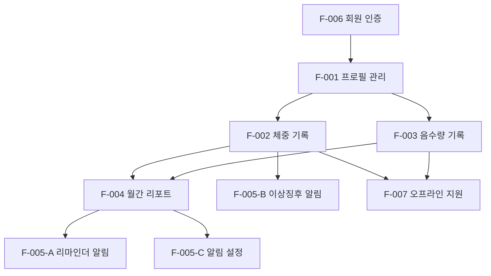

# 기능 명세서

**프로젝트명**: 반려동물 건강 기록 웹앱
**작성일**: 2026-06-19
**버전**: v1.0
**참조 문서**: 요구사항정의서.md, 서비스기획서.md, PRD.md

---

## 기능 목록

| F-ID | 기능명 | 요구사항 ID | 우선순위 | 상태 |
|------|--------|-------------|----------|------|
| F-001 | 반려동물 프로필 관리 | REQ-001, REQ-002, REQ-003 | Must | 미착수 |
| F-002 | 데일리 체중 기록 | REQ-004, REQ-005, REQ-006, REQ-007 | Must | 미착수 |
| F-003 | 데일리 음수량 기록 | REQ-008, REQ-009, REQ-010 | Must | 미착수 |
| F-004 | 월간 건강 리포트 | REQ-011, REQ-012, REQ-013, REQ-014, REQ-015 | Must / Should | 미착수 |
| F-005 | 알림 | REQ-016, REQ-017, REQ-018 | Should | 미착수 |
| F-006 | 회원 인증 | REQ-019, REQ-020, REQ-021 | Must | 미착수 |
| F-007 | 오프라인 지원 | REQ-022, REQ-023 | Must | 미착수 |

---

## 기능 상세

### F-001. 반려동물 프로필 관리

| 항목 | 내용 |
|------|------|
| 설명 | 보호자가 반려동물의 기본 정보를 등록·수정·삭제하는 기능. 이후 모든 기록(체중·음수량)과 리포트는 프로필에 귀속됨 |
| 관련 요구사항 | REQ-001, REQ-002, REQ-003 |
| 관련 화면 | 온보딩 프로필 등록 화면, 마이페이지 프로필 수정 화면, 프로필 삭제 확인 모달 |
| 관련 API | POST /api/pets, GET /api/pets/:id, PATCH /api/pets/:id, DELETE /api/pets/:id |

#### F-001-A. 프로필 등록

| 항목 | 내용 |
|------|------|
| 입력 | 이름(필수), 종 — 강아지/고양이(필수), 품종(선택), 생년월일(선택), 성별(선택), 중성화 여부(선택), 프로필 사진 — JPG/PNG(선택) |
| 처리 | 1. 필수 항목(이름, 종) 입력 여부 클라이언트 유효성 검사 2. 사진 첨부 시 클라이언트에서 이미지 파일 형식(JPG/PNG) 검증 후 Supabase Storage에 업로드, 반환된 URL 저장 3. 미첨부 시 종별 기본 아이콘 URL 적용 4. 반려동물 레코드를 `pets` 테이블에 INSERT, 로그인 사용자 ID(`user_id`)와 연결 5. 등록 성공 후 홈 화면으로 이동 |
| 출력 | 프로필 저장 완료 토스트 알림 / 홈 화면에 신규 프로필 카드 노출 |
| 예외 처리 | 필수 항목 미입력 시 해당 필드 오류 메시지 표시, 저장 불가 처리 허용되지 않는 이미지 형식 업로드 시 "JPG 또는 PNG 파일만 가능합니다" 오류 표시 이미지 업로드 실패(네트워크 오류 등) 시 기본 이미지 적용 후 저장 진행 |

#### F-001-B. 프로필 수정

| 항목 | 내용 |
|------|------|
| 입력 | 기존 등록 필드 전체 수정 가능 (이름·종·품종·생년월일·성별·중성화 여부·사진) |
| 처리 | 1. 변경된 필드만 PATCH 요청으로 `pets` 테이블 UPDATE 2. 사진 교체 시 기존 Storage 파일 삭제 후 신규 파일 업로드 3. 변경 즉시 홈 화면 프로필 카드에 반영 |
| 출력 | 수정 완료 토스트 알림 / 변경 내용 즉시 반영 |
| 예외 처리 | 이름 공백으로 저장 시도 시 오류 메시지 표시 저장 실패(서버 오류) 시 "저장에 실패했습니다. 다시 시도해주세요" 오류 토스트 표시 |

#### F-001-C. 프로필 삭제

| 항목 | 내용 |
|------|------|
| 입력 | 삭제 버튼 탭 → 삭제 확인 모달에서 "삭제" 선택 |
| 처리 | 1. 삭제 확인 모달 표시 (반려동물 이름, "모든 기록이 함께 삭제됩니다" 경고 문구 포함) 2. 확인 선택 시 해당 `pet_id`에 귀속된 체중 기록·음수량 기록·리포트 데이터 일괄 삭제 (CASCADE) 3. `pets` 테이블 레코드 DELETE 4. Supabase Storage 프로필 사진 파일 삭제 |
| 출력 | 삭제 완료 후 홈 화면으로 이동 / "프로필이 삭제되었습니다" 토스트 알림 |
| 예외 처리 | 모달에서 "취소" 선택 시 삭제 중단, 수정 화면 유지 삭제 실패(서버 오류) 시 오류 토스트 표시, 데이터 유지 |

---

### F-002. 데일리 체중 기록

| 항목 | 내용 |
|------|------|
| 설명 | 보호자가 날짜별 반려동물 체중을 입력하고, 추이 차트·변화량·권장 범위를 확인하는 기능 |
| 관련 요구사항 | REQ-004, REQ-005, REQ-006, REQ-007 |
| 관련 화면 | 홈 화면(체중 차트 위젯), 체중 기록 입력 화면, 체중 이력 목록 화면 |
| 관련 API | POST /api/pets/:id/weights, GET /api/pets/:id/weights, PATCH /api/pets/:id/weights/:date, DELETE /api/pets/:id/weights/:date |

#### F-002-A. 체중 입력 및 저장

| 항목 | 내용 |
|------|------|
| 입력 | 날짜(기본값: 오늘), 체중 — kg 단위, 소수점 1자리 (예: 4.3) |
| 처리 | 1. 입력값 범위 검사: 0.1 이상 99.9 이하, 소수점 1자리 초과 입력 시 자동 반올림 2. 당일 기록이 이미 존재하는 경우 기존 레코드 UPDATE, 없으면 INSERT 3. 전일 기록이 존재할 경우 변화량 계산: `(입력값 - 전일값) / 전일값 × 100` 4. 변화율이 ±15% 초과 시 재확인 컨펌 모달 표시 ("체중이 전일 대비 N% [증가/감소]했습니다. 맞나요?") 5. 확인 후 `weight_logs` 테이블에 저장, 저장 응답 시간 목표 ≤ 1초 6. 이상 징후 알림 검사(F-005-B)와 비동기 병렬 수행 |
| 출력 | 저장 완료 토스트 / 홈 화면 차트 즉시 갱신 / 전일 대비 변화량 표시 갱신 |
| 예외 처리 | 범위 초과 입력(0.1 미만 또는 99.9 초과) 시 입력 필드 오류 메시지 표시, 저장 불가 숫자 이외 문자 입력 시 입력 자체 차단 (숫자 키패드 제공) 재확인 모달에서 "취소" 선택 시 입력 필드로 복귀, 저장 불가 |

#### F-002-B. 체중 추이 차트

| 항목 | 내용 |
|------|------|
| 입력 | 기간 필터 선택: 7일 / 30일 / 90일 (기본값: 30일) |
| 처리 | 1. 선택된 기간 내 체중 로그 조회 (GET /api/pets/:id/weights?range=30) 2. Recharts LineChart로 날짜별 체중 추이 렌더링 3. 이상 징후 감지일(최근 7일 평균 대비 10% 이상 감소)은 빨간색 데이터 포인트로 강조 4. 필터 변경 시 즉시 재조회·재렌더링 |
| 출력 | 날짜(X축) vs 체중(Y축) 라인 차트 / 데이터 포인트 탭 시 날짜·체중값 툴팁 표시 |
| 예외 처리 | 기록이 0건이면 "아직 기록이 없습니다" 빈 상태 UI 표시 기록이 1건이면 차트 대신 단일 포인트 및 안내 문구 표시 |

#### F-002-C. 전일 대비 변화량 표시

| 항목 | 내용 |
|------|------|
| 입력 | 없음 (체중 저장 시 자동 계산) |
| 처리 | 1. 최근 저장된 체중과 그 직전 날짜의 체중 레코드를 조회 2. 변화량 = 오늘 체중 - 전일 체중 (소수점 1자리 반올림) 3. 양수면 ▲(증가), 음수면 ▼(감소), 0이면 변화 없음(-)으로 표시 |
| 출력 | 홈 화면 및 기록 화면에 "전일 대비 ▲/▼ N.Nkg" 형태로 표시 |
| 예외 처리 | 전일 기록이 없을 경우 변화량 UI 미표시 (빈 영역으로 처리) |

#### F-002-D. 권장 체중 범위 표시

| 항목 | 내용 |
|------|------|
| 입력 | 프로필의 종(강아지/고양이), 품종, 생년월일 |
| 처리 | 1. 프로필 종·품종·생년월일 조합으로 내부 데이터셋(주요 품종 50종 이상) 참조 2. 해당 품종·연령대별 권장 체중 최솟값·최댓값(kg) 조회 3. 체중 기록 화면 내 "권장 체중 N.N~N.Nkg" 형태로 표시 4. 입력값이 권장 범위 벗어날 경우 범위 표시를 주황색으로 강조 |
| 출력 | 권장 체중 범위 텍스트 및 색상 강조 |
| 예외 처리 | 프로필에 종·품종·생년월일 중 하나라도 미등록 시 권장 범위 UI 미표시 데이터셋에 해당 품종이 없을 경우 "종 기준 평균 체중" 범위로 대체 표시 |

---

### F-003. 데일리 음수량 기록

| 항목 | 내용 |
|------|------|
| 설명 | 보호자가 날짜별 반려동물 음수량을 ml 단위로 입력하고, 권장 범위와 비교하는 기능 |
| 관련 요구사항 | REQ-008, REQ-009, REQ-010 |
| 관련 화면 | 음수량 기록 입력 화면, 홈 화면(음수량 위젯), 설정 화면(물그릇 용량 설정) |
| 관련 API | POST /api/pets/:id/water-logs, GET /api/pets/:id/water-logs, PATCH /api/pets/:id/water-logs/:date |

#### F-003-A. 음수량 직접 입력 및 증감 버튼

| 항목 | 내용 |
|------|------|
| 입력 | 날짜(기본값: 오늘), 음수량 — ml 단위 정수 직접 입력 또는 [- 10ml] / [+ 10ml] 버튼 탭 |
| 처리 | 1. 입력값 범위 검사: 0 이상 9,999 이하 정수 2. [+ 10ml] / [- 10ml] 버튼 탭 시 현재값에 10 가산/감산, 0 미만으로는 감산 불가 3. 당일 기록이 이미 존재하는 경우 기존 레코드 UPDATE, 없으면 INSERT 4. `water_logs` 테이블에 저장, 저장 응답 시간 목표 ≤ 1초 |
| 출력 | 저장 완료 토스트 / 홈 화면 음수량 위젯 즉시 갱신 |
| 예외 처리 | 범위 초과 입력(9,999 초과) 시 입력 필드 오류 메시지 표시, 저장 불가 음수 값 직접 입력 시 0으로 자동 보정 문자 입력 시 차단 (숫자 키패드 강제 적용) |

#### F-003-B. 물그릇 잔여량 역산

| 항목 | 내용 |
|------|------|
| 입력 | 물그릇 최대 용량(ml) — 설정 화면에서 사전 등록 / 오늘 채운 횟수 및 현재 잔여량(ml) |
| 처리 | 1. 설정에서 물그릇 용량(capacity)을 `user_settings` 테이블에 저장 2. 잔여량 입력 모드 활성화 시: `음수량 = (채운 횟수 × capacity) - 잔여량` 자동 계산 3. 계산된 값을 음수량 입력란에 자동 반영, 보호자가 최종 확인 후 저장 |
| 출력 | 음수량 입력란에 자동 계산값 자동 채움 |
| 예외 처리 | 물그릇 용량 미설정 시 역산 모드 비활성화, "물그릇 용량을 먼저 설정해주세요" 안내 표시 잔여량이 물그릇 용량을 초과 입력 시 오류 메시지 표시, 저장 불가 |

#### F-003-C. 권장 음수량 범위 표시

| 항목 | 내용 |
|------|------|
| 입력 | 가장 최근 체중 기록값(kg) |
| 처리 | 1. 권장 일일 음수량 계산: `체중(kg) × 50ml` (최솟값) ~ `체중(kg) × 70ml` (최댓값) 2. 기록 화면 내 "권장 음수량 NNN~NNNml" 형태로 표시 3. 입력값이 권장 범위 미달 시 주황색으로 강조 |
| 출력 | 권장 음수량 범위 텍스트 및 색상 강조 |
| 예외 처리 | 당일 또는 최근 7일 내 체중 기록이 없을 경우 "체중 기록 후 권장량이 표시됩니다" 안내 표시 |

---

### F-004. 월간 건강 리포트

| 항목 | 내용 |
|------|------|
| 설명 | 매월 1일 전월 데이터를 기반으로 건강 리포트를 자동 생성하고, PDF로 내보내거나 공유하는 기능 |
| 관련 요구사항 | REQ-011, REQ-012, REQ-013, REQ-014, REQ-015 |
| 관련 화면 | 리포트 목록 화면, 리포트 상세 화면, PDF 미리보기/공유 화면 |
| 관련 API | GET /api/pets/:id/reports, GET /api/pets/:id/reports/:year/:month, POST /api/pets/:id/reports/export-pdf |

#### F-004-A. 리포트 자동 생성

| 항목 | 내용 |
|------|------|
| 입력 | 없음 (자동 실행 — Vercel Cron Job, 매월 1일 00:00 UTC 기준) |
| 처리 | 1. Vercel Cron Job이 매월 1일 00:00~06:00 사이에 모든 활성 사용자의 전월 데이터 집계 작업 실행 2. 기간: 전월 1일 00:00:00 ~ 전월 말일 23:59:59 (UTC 기준) 3. 항목별 계산: 월간 평균 체중, 전월 대비 체중 변화, 월간 평균 음수량, 전월 대비 음수량 변화 4. 일별 체중·음수량 데이터 배열 생성 (기록 없는 날은 `null`로 처리) 5. 이상 징후 날짜 마킹: 최근 7일 평균 대비 당일 체중이 10% 이상 감소한 날 목록 추출 6. `monthly_reports` 테이블에 집계 결과 INSERT 7. 완료 후 푸시 알림 스케줄 등록 (오전 9시~10시 사이 무작위 발송) |
| 출력 | `monthly_reports` 테이블에 리포트 레코드 생성 완료 |
| 예외 처리 | 전월 기록이 0건인 경우 "기록 없음" 상태 리포트 생성 후 알림은 발송하지 않음 생성 중 오류 발생 시 최대 3회 재시도 후 실패 로그 기록 |

#### F-004-B. 리포트 조회

| 항목 | 내용 |
|------|------|
| 입력 | 리포트 목록에서 월 선택 |
| 처리 | 1. `monthly_reports` 테이블에서 해당 월 리포트 데이터 조회 2. 30일 추이 라인 차트 렌더링 (체중·음수량 이중 Y축 또는 탭 전환) 3. 이상 징후 날짜 빨간색 강조 포인트 렌더링 4. 통계 요약 섹션(평균 체중, 평균 음수량, 전월 대비) 표시 |
| 출력 | 리포트 상세 화면: 통계 요약 카드 + 30일 라인 차트 + 이상 징후 목록 |
| 예외 처리 | 리포트 미생성 월 접근 시 "해당 월 리포트가 없습니다" 안내 표시 조회 중 오류 시 오류 메시지 및 새로고침 버튼 제공 |

#### F-004-C. PDF 내보내기

| 항목 | 내용 |
|------|------|
| 입력 | 리포트 상세 화면 내 "PDF 내보내기" 버튼 탭 |
| 처리 | 1. PDF 생성 요청 즉시 로딩 오버레이 및 스피너 표시 (차단 UI) 2. 서버에서 리포트 데이터를 HTML 템플릿에 주입 후 Puppeteer/html2pdf 등으로 PDF 변환 3. 생성 완료(목표 ≤ 5초) 후 Blob URL 생성 4. OS 기본 공유/저장 시트 표시 또는 직접 다운로드 |
| 출력 | PDF 파일 다운로드 / 공유 시트 오픈 (파일명: `{반려동물명}_건강리포트_{YYYY-MM}.pdf`) |
| 예외 처리 | 생성 5초 초과 시 타임아웃 오류 토스트 표시, 재시도 버튼 제공 생성 중 오류 시 로딩 오버레이 해제 후 오류 메시지 표시 |

#### F-004-D. 리포트 공유

| 항목 | 내용 |
|------|------|
| 입력 | 리포트 상세 화면 내 "공유" 버튼 탭 |
| 처리 | 1. Web Share API 지원 브라우저: OS 기본 공유 시트 호출 (카카오톡·메시지·이메일 등 자동 포함) 2. Web Share API 미지원 브라우저: 앱 내 공유 옵션 목록 모달 표시 (PDF 다운로드 유도) 3. 공유 대상이 PDF인 경우 F-004-C 호출 후 파일 공유 |
| 출력 | OS 공유 시트 또는 앱 내 공유 옵션 모달 |
| 예외 처리 | Web Share API 미지원 환경에서 공유 실패 시 "PDF를 다운로드하여 직접 공유하세요" 안내 표시 |

---

### F-005. 알림

| 항목 | 내용 |
|------|------|
| 설명 | 기록 리마인더, 이상 징후 감지, 월간 리포트 완성 시 보호자에게 푸시 알림을 발송하는 기능 |
| 관련 요구사항 | REQ-016, REQ-017, REQ-018 |
| 관련 화면 | 설정 화면(알림 설정), 알림 수신 화면 |
| 관련 API | POST /api/notifications/subscribe, GET /api/notifications/settings, PATCH /api/notifications/settings |

#### F-005-A. 기록 리마인더 알림

| 항목 | 내용 |
|------|------|
| 입력 | 없음 (Vercel Cron Job 자동 실행) / 설정 화면에서 알림 시간 변경 가능 (기본값: 저녁 8시) |
| 처리 | 1. Vercel Cron Job이 매일 사용자별 설정 알림 시간에 실행 2. 당일 체중 또는 음수량 기록이 없는 보호자만 대상으로 선별 3. Web Push API를 통해 리마인더 알림 발송 (제목: "오늘 [반려동물명]의 기록을 입력해주세요") 4. iOS 16.4 미만 등 Web Push 미지원 환경에서는 알림 미발송 (In-App 배너로 대체 안내) |
| 출력 | 기기 푸시 알림 수신 |
| 예외 처리 | 알림 권한 미허용 사용자 제외 당일 기록이 이미 완료된 경우 알림 미발송 발송 실패(토큰 만료 등) 시 DB에서 해당 토큰 비활성화 처리 |

#### F-005-B. 이상 징후 감지 알림

| 항목 | 내용 |
|------|------|
| 입력 | 체중 저장 이벤트 (F-002-A 저장 완료 후 비동기 호출) |
| 처리 | 1. 저장된 체중 기준 최근 7일(당일 제외) 체중 로그 조회 2. 7일 평균 계산 (기록 없는 날 제외, 최소 1건 이상 필요) 3. 감소율 계산: `(7일평균 - 오늘체중) / 7일평균 × 100` 4. 감소율이 10% 이상인 경우 즉시 푸시 알림 발송    - 제목: "[반려동물명] 체중 이상 징후 감지"    - 본문: "최근 7일 평균 대비 N.N% 감소했습니다. 동물병원 방문을 권고합니다." 5. 동일 반려동물에 대해 24시간 내 중복 이상 징후 알림 미발송 (쿨타임 적용) |
| 출력 | 이상 징후 푸시 알림 수신 |
| 예외 처리 | 최근 7일 기록이 0건인 경우 알림 미발송 알림 권한 미허용 사용자 제외 감소가 아닌 증가 시 이상 징후 알림 미발송 (체중 증가는 별도 임계값 정의 없음 — v1.1 검토) |

#### F-005-C. 알림 수신 설정

| 항목 | 내용 |
|------|------|
| 입력 | 설정 화면에서 알림 종류별 ON/OFF 토글 및 리마인더 시간 설정 |
| 처리 | 1. 변경 즉시 PATCH /api/notifications/settings 호출하여 `user_settings` 테이블 UPDATE 2. OFF 처리 시 해당 알림 유형의 Cron 제외 대상으로 등록 |
| 출력 | 설정 변경 즉시 반영 토스트 알림 |
| 예외 처리 | 설정 변경 실패(서버 오류) 시 이전 상태로 복원 및 오류 토스트 표시 |

---

### F-006. 회원 인증

| 항목 | 내용 |
|------|------|
| 설명 | 카카오·구글 소셜 로그인 기반 회원가입·로그인·세션 유지·로그아웃·탈퇴 기능 |
| 관련 요구사항 | REQ-019, REQ-020, REQ-021 |
| 관련 화면 | 로그인/시작 화면, 온보딩 화면, 설정 화면(로그아웃·탈퇴) |
| 관련 API | POST /api/auth/social (Supabase Auth 위임), DELETE /api/auth/me |

#### F-006-A. 소셜 로그인

| 항목 | 내용 |
|------|------|
| 입력 | "카카오로 시작하기" 또는 "구글로 시작하기" 버튼 탭 |
| 처리 | 1. Supabase Auth OAuth 흐름 실행 (팝업 또는 리디렉션 방식) 2. 인증 성공 시 Supabase가 JWT Access Token(만료 7일) 및 Refresh Token 발급 3. 토큰을 브라우저 localStorage에 저장 4. 최초 로그인(신규 가입) 여부 확인: `users` 테이블에 해당 소셜 ID 미존재 시 신규 레코드 INSERT 5. 신규 가입 시 온보딩(프로필 등록, F-001-A) 화면으로 이동 6. 기존 회원 로그인 시 홈 화면으로 이동 |
| 출력 | 로그인 성공 시 홈 또는 온보딩 화면으로 이동 |
| 예외 처리 | 소셜 인증 취소(팝업 닫기 등) 시 로그인 화면으로 복귀, 오류 메시지 미표시 소셜 인증 서버 오류 시 "로그인에 실패했습니다. 다시 시도해주세요" 오류 토스트 표시 카카오·구글 서비스 장애 시 재시도 안내 표시 |

#### F-006-B. 세션 유지

| 항목 | 내용 |
|------|------|
| 입력 | 앱 재방문 (탭/브라우저 재오픈) |
| 처리 | 1. 앱 초기화 시 localStorage에서 Refresh Token 조회 2. Supabase Auth가 자동으로 Access Token 갱신 시도 3. 갱신 성공 시 홈 화면으로 바로 이동 4. Refresh Token 만료 또는 미존재 시 로그인 화면으로 이동 |
| 출력 | 유효 세션 존재 시 로그인 화면 없이 홈 화면 진입 |
| 예외 처리 | Refresh Token 만료 시 자동 로그아웃 처리 후 "세션이 만료되었습니다. 다시 로그인해주세요" 안내 표시 |

#### F-006-C. 로그아웃 및 회원 탈퇴

| 항목 | 내용 |
|------|------|
| 입력 | 로그아웃: 설정 화면 > "로그아웃" 버튼 / 탈퇴: 설정 화면 > "회원 탈퇴" 버튼 → 확인 모달 |
| 처리 | [로그아웃] 1. Supabase Auth `signOut()` 호출 2. localStorage에서 토큰 삭제 3. 로그인 화면으로 이동  [회원 탈퇴] 1. 탈퇴 확인 모달 표시 (탈퇴 후 30일간 데이터 보존, 이후 완전 삭제 안내 포함) 2. 확인 시 `users` 테이블의 `deleted_at` 필드에 탈퇴 일시 기록 (소프트 삭제) 3. Supabase Auth 계정 비활성화 4. 로그인 화면으로 이동 5. 스케줄러가 `deleted_at + 30일` 경과 시 해당 사용자 모든 데이터 완전 삭제 |
| 출력 | 로그아웃: 로그인 화면 이동 / 탈퇴: "탈퇴가 완료되었습니다" 토스트 후 로그인 화면 이동 |
| 예외 처리 | 탈퇴 모달에서 "취소" 선택 시 탈퇴 중단, 설정 화면 유지 탈퇴 처리 실패 시 오류 토스트 표시, 계정 상태 유지 |

---

### F-007. 오프라인 지원

| 항목 | 내용 |
|------|------|
| 설명 | PWA Service Worker를 활용하여 네트워크 미연결 상태에서도 체중·음수량 기록을 가능하게 하고, 연결 복구 시 서버와 자동 동기화하는 기능 |
| 관련 요구사항 | REQ-022, REQ-023 |
| 관련 화면 | 홈 화면, 기록 입력 화면 (오프라인 상태 배너 포함) |
| 관련 API | POST /api/pets/:id/weights, POST /api/pets/:id/water-logs (온라인 복구 후 자동 호출) |

#### F-007-A. 오프라인 기록

| 항목 | 내용 |
|------|------|
| 입력 | 네트워크 미연결 상태에서 체중 또는 음수량 입력 후 저장 버튼 탭 |
| 처리 | 1. Service Worker가 네트워크 미연결 감지 시 화면 상단에 "오프라인 모드" 배너 표시 2. 저장 요청 발생 시 서버 호출 대신 IndexedDB의 `pending_sync` 큐에 기록 저장 3. 저장된 기록에 `synced: false` 및 `created_at` 타임스탬프 기록 4. 홈 화면 차트는 IndexedDB 데이터를 기반으로 렌더링 |
| 출력 | "기록이 저장되었습니다 (오프라인)" 토스트 표시 / 홈 화면 차트에 즉시 반영 |
| 예외 처리 | IndexedDB 저장 실패 시 "기록 저장에 실패했습니다. 온라인 상태에서 다시 시도해주세요" 오류 표시 동일 날짜 오프라인 중복 기록 발생 시 가장 최근 값으로 덮어쓰기 |

#### F-007-B. 자동 동기화

| 항목 | 내용 |
|------|------|
| 입력 | 없음 (Service Worker가 `online` 이벤트 감지 시 자동 실행) |
| 처리 | 1. Service Worker `online` 이벤트 감지 즉시 Background Sync 등록 2. IndexedDB `pending_sync` 큐에서 `synced: false` 기록 전체 조회 3. 기록별로 타임스탬프 오름차순 정렬 후 서버 API 순차 호출 4. 데이터 충돌 해결 원칙: Last-Write-Wins — 서버 기존 레코드와 타임스탬프 비교 후 더 늦은 타임스탬프의 기록을 최종 반영 5. 각 기록 동기화 성공 시 IndexedDB에서 해당 레코드 `synced: true` 갱신 6. 전체 동기화 완료 후 홈 화면 차트 서버 데이터 기준으로 재렌더링 (목표: 연결 복구 후 60초 이내) |
| 출력 | 동기화 완료 토스트 ("오프라인 기록이 동기화되었습니다") / 홈 화면 차트 갱신 |
| 예외 처리 | 개별 기록 동기화 실패 시 해당 기록만 큐에 유지, 나머지 계속 진행 재시도 3회 실패 후에도 동기화 안 된 기록은 "동기화 실패 기록" 표시로 보호자에게 안내 서버 응답 4xx 오류(데이터 유효성 위반 등) 시 해당 기록 큐에서 제거 후 오류 로그 기록 |

---

## 기능 간 의존관계

---

## 비기능 요구사항 연계

| NFR ID | 연계 기능 | 구현 방안 |
|--------|-----------|-----------|
| NFR-001 (저장 응답 ≤ 1초) | F-002-A, F-003-A | Supabase 단일 INSERT/UPDATE, 인덱스 최적화 |
| NFR-002 (LCP ≤ 2.5초) | 전체 화면 | Vite 코드 스플리팅, 이미지 lazy load, Service Worker 캐싱 |
| NFR-003 (PDF 생성 ≤ 5초) | F-004-C | 서버사이드 PDF 생성, Vercel Function 타임아웃 10초 설정 |
| NFR-006 (RLS 적용) | F-001~F-004 | Supabase Row-Level Security, `user_id` 기반 정책 |
| NFR-007 (JWT 7일, Refresh) | F-006 | Supabase Auth 기본 설정 활용 |
| NFR-009 (오프라인 캐싱) | F-007 | Service Worker Cache API: 홈·기록 화면 캐싱 |
| NFR-010 (WCAG 2.1 AA) | 전체 화면 | 컬러 대비 4.5:1 이상, aria-label, 키보드 탐색 |

---

**작성 완료 여부**: [x] 기능명세서 작성 완료 (2026-06-19)
