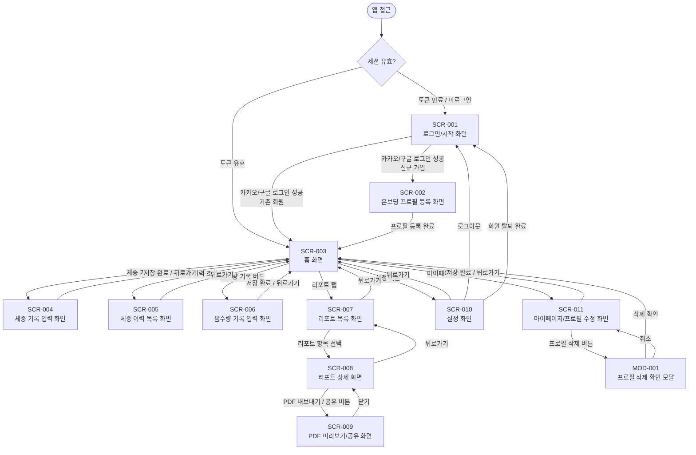
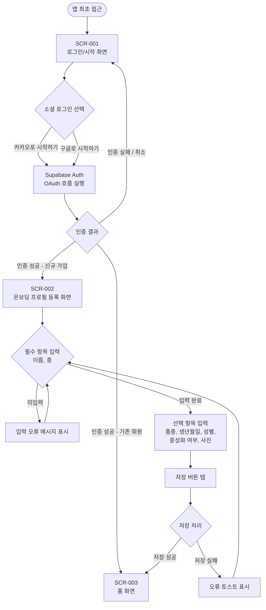
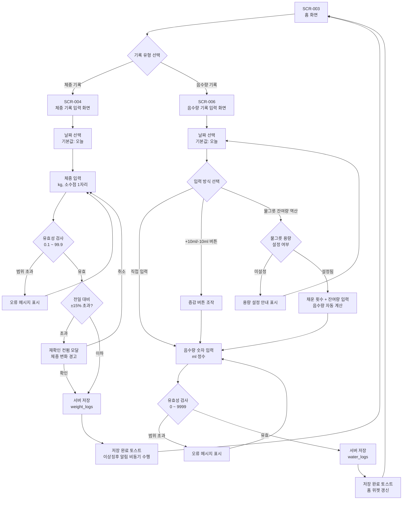
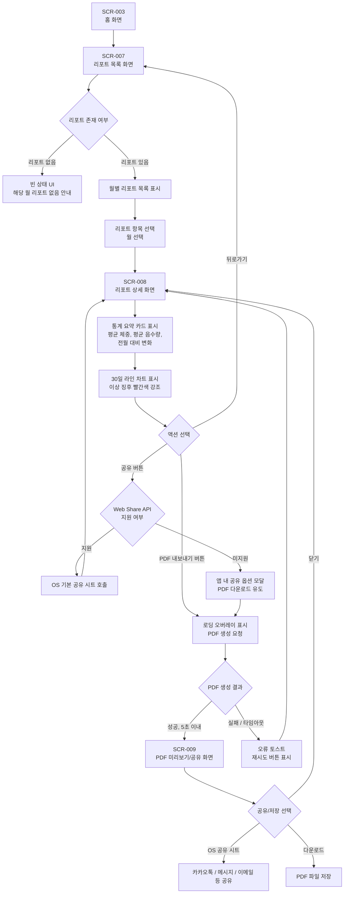

# 정보구조도

**프로젝트명**: 반려동물 건강 기록 웹앱
**작성일**: 2026-06-19
**버전**: v1.0
**참조 문서**: 기능명세서.md, 요구사항정의서.md, PRD.md

---

## 1. 개요

### 1.1 목적

본 정보구조도는 반려동물 건강 기록 웹앱(PWA)의 화면 계층 구조와 사용자 이동 흐름을 시각화하여, 화면설계서 및 개발 구현의 기준 문서로 활용한다.

### 1.2 범위

| 항목 | 내용 |
|------|------|
| 서비스 유형 | 반려동물 건강 데이터 트래킹 웹앱 (PWA, 브라우저 기반) |
| 지원 플랫폼 | Chrome 90+, Safari 14+, Firefox 90+, Edge 90+ |
| 인증 방식 | 카카오·구글 소셜 로그인 (Supabase Auth) |
| 주요 기능 | 프로필 관리, 체중 기록, 음수량 기록, 월간 리포트, 알림, 설정 |

### 1.3 주요 화면 수

| 구분 | 화면 수 |
|------|---------|
| 인증 영역 | 1개 (로그인/시작 화면) |
| 온보딩 영역 | 1개 (온보딩/프로필 등록 화면) |
| 메인 기능 영역 | 8개 (홈, 체중 기록 입력, 체중 이력 목록, 음수량 기록 입력, 리포트 목록, 리포트 상세, PDF 미리보기/공유, 마이페이지/프로필 수정) |
| 설정 영역 | 1개 (설정 화면) |
| 모달 | 1개 (프로필 삭제 확인 모달) |
| **합계** | **12개 화면 + 1개 모달** |

---

## 2. 전체 정보구조도

---

## 3. 사용자 흐름별 상세 다이어그램

### 3.1 신규 사용자 온보딩 흐름

### 3.2 데일리 기록 흐름 (체중 / 음수량)

### 3.3 월간 리포트 조회 및 PDF 공유 흐름

---

## 4. 화면 목록 정의

| 화면 ID | 화면명 | 설명 | 관련 기능 ID | 진입 조건 |
|---------|--------|------|-------------|-----------|
| SCR-001 | 로그인/시작 화면 | 카카오·구글 소셜 로그인 버튼 제공. 비인증 사용자의 앱 진입 시작점 | F-006 | 세션 없음 또는 만료 상태 |
| SCR-002 | 온보딩 프로필 등록 화면 | 소셜 로그인 후 신규 가입 사용자 대상 반려동물 프로필 최초 등록 화면 | F-001 (F-001-A) | 신규 가입 완료 (최초 1회) |
| SCR-003 | 홈 화면 | 체중 차트 위젯, 음수량 위젯, 빠른 기록 버튼, 하단 탭 내비게이션 포함. 인증된 사용자의 주요 진입점 | F-002 (F-002-B, F-002-C), F-003, F-007 | 로그인 상태 (세션 유효) |
| SCR-004 | 체중 기록 입력 화면 | 날짜 선택, 체중(kg) 입력, 전일 대비 변화량 표시, 권장 체중 범위 안내, 저장 버튼 포함 | F-002 (F-002-A, F-002-C, F-002-D) | 로그인 상태 / 홈에서 체중 기록 버튼 탭 |
| SCR-005 | 체중 이력 목록 화면 | 날짜별 체중 기록 목록 조회. 기간 필터(7일/30일/90일) 지원 | F-002 (F-002-B) | 로그인 상태 / 홈에서 체중 이력 조회 탭 |
| SCR-006 | 음수량 기록 입력 화면 | 날짜 선택, 음수량(ml) 직접 입력 또는 증감 버튼, 물그릇 잔여량 역산, 권장 음수량 안내, 저장 버튼 포함 | F-003 (F-003-A, F-003-B, F-003-C) | 로그인 상태 / 홈에서 음수량 기록 버튼 탭 |
| SCR-007 | 리포트 목록 화면 | 생성된 월간 리포트 목록 표시. 미생성 월에 대한 빈 상태 UI 포함 | F-004 (F-004-B) | 로그인 상태 / 하단 탭 리포트 탭 선택 |
| SCR-008 | 리포트 상세 화면 | 선택된 월의 통계 요약 카드(평균 체중, 평균 음수량, 전월 대비), 30일 라인 차트, 이상 징후 목록, PDF/공유 버튼 포함 | F-004 (F-004-B, F-004-C, F-004-D) | 로그인 상태 / 리포트 목록에서 항목 선택 |
| SCR-009 | PDF 미리보기/공유 화면 | 생성된 PDF 미리보기 및 OS 공유 시트 또는 다운로드 옵션 제공 | F-004 (F-004-C, F-004-D) | 리포트 상세 화면에서 PDF 내보내기 버튼 탭 |
| SCR-010 | 설정 화면 | 알림 종류별 ON/OFF 토글, 리마인더 시간 설정, 물그릇 용량 설정, 로그아웃, 회원 탈퇴 메뉴 포함 | F-003 (F-003-B), F-005 (F-005-C), F-006 (F-006-C) | 로그인 상태 / 하단 탭 설정 선택 |
| SCR-011 | 마이페이지/프로필 수정 화면 | 등록된 반려동물 프로필 정보 수정 (이름, 종, 품종, 생년월일, 성별, 중성화 여부, 사진). 프로필 삭제 버튼 포함 | F-001 (F-001-B, F-001-C) | 로그인 상태 / 홈 또는 하단 탭 마이페이지 선택 |
| MOD-001 | 프로필 삭제 확인 모달 | 반려동물 프로필 및 전체 기록 삭제에 대한 경고 문구와 확인/취소 버튼 포함 | F-001 (F-001-C) | 프로필 수정 화면에서 삭제 버튼 탭 |

---

## 5. 네비게이션 구조

### 5.1 하단 탭바 구성

하단 탭바는 인증된 사용자(로그인 상태)에게 노출되며, 앱의 주요 섹션 간 빠른 이동을 제공한다.

| 탭 순서 | 탭 라벨 | 연결 화면 | 비고 |
|---------|---------|-----------|------|
| 1 | 홈 | SCR-003 (홈 화면) | 기본 활성 탭 |
| 2 | 기록 | SCR-004 (체중 기록 입력) / SCR-006 (음수량 기록 입력) | 탭 선택 시 기록 유형 선택 시트 표시 |
| 3 | 리포트 | SCR-007 (리포트 목록 화면) | - |
| 4 | 마이페이지 | SCR-011 (마이페이지/프로필 수정) | - |
| 5 | 설정 | SCR-010 (설정 화면) | - |

### 5.2 화면 계층 구조 (Depth)

| Depth | 화면 목록 | 진입 방법 |
|-------|-----------|-----------|
| Depth 0 (비인증) | SCR-001 로그인/시작 화면 | 앱 최초 접근 / 세션 만료 |
| Depth 0 (온보딩) | SCR-002 온보딩 프로필 등록 | 신규 가입 시 최초 1회 |
| Depth 0 (인증) | SCR-003 홈 화면 | 로그인 성공 / 세션 유효 재방문 |
| Depth 1 (탭 레벨) | SCR-007 리포트 목록, SCR-010 설정, SCR-011 마이페이지 | 하단 탭바 탭 |
| Depth 2 (서브 화면) | SCR-004 체중 기록 입력, SCR-005 체중 이력 목록, SCR-006 음수량 기록 입력, SCR-008 리포트 상세 | 홈 또는 탭 레벨에서 이동 |
| Depth 3 (서브 서브) | SCR-009 PDF 미리보기/공유 | 리포트 상세에서 이동 |
| 오버레이 | MOD-001 프로필 삭제 확인 모달 | 마이페이지 화면 위 레이어 표시 |

### 5.3 전역 네비게이션 규칙

| 규칙 | 내용 |
|------|------|
| 뒤로가기 | Depth 2 이상 화면에서 뒤로가기 버튼 노출. 상위 화면으로 이동 |
| 탭바 표시 | 로그인 상태(Depth 1 이상)에서 항상 하단 탭바 표시. 로그인/온보딩 화면에서는 숨김 |
| 세션 만료 처리 | API 호출 중 401 응답 수신 시 자동 로그아웃 처리 후 SCR-001로 이동 |
| 오프라인 배너 | 네트워크 미연결 상태에서 홈·기록 화면 상단에 "오프라인 모드" 배너 표시 |
| 모달 닫기 | 모달 외부 영역 탭 또는 취소 버튼으로 닫기. 삭제 확인 모달은 취소 시 수정 화면 유지 |

---

**작성 완료 여부**: [x] 정보구조도 작성 완료 (2026-06-19)
