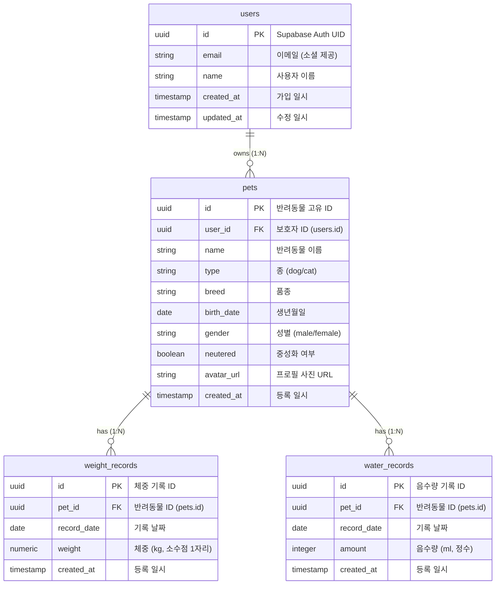

# 데이터베이스 설계서

> 데이터베이스의 논리적/물리적 구조를 정의한다. 본 설계서는 다두 펫 지원(v1.1)에 대비하여 1:N 확장 구조를 의무 적용하였으며, 개인정보 및 건강 데이터 보호를 위한 RLS 보안 기준을 포함합니다.

## ERD (Entity-Relationship Diagram)

## 테이블 정의

### users (사용자 테이블)
* **RLS 정책**: 로그인한 사용자(Authenticated)는 자신의 ID와 일치하는 row만 SELECT, UPDATE할 수 있음.

| 컬럼명 | 타입 | 제약조건 | 기본값 | 설명 |
|--------|------|----------|--------|------|
| id | UUID | PK, References auth.users.id | - | Supabase Auth 연동 고유 ID |
| email | VARCHAR(255) | UNIQUE, NOT NULL | - | 소셜 로그인 제공 이메일 |
| name | VARCHAR(100) | NOT NULL | - | 사용자 이름 |
| created_at | TIMESTAMP WITH TIME ZONE | NOT NULL | NOW() | 가입 일시 |
| updated_at | TIMESTAMP WITH TIME ZONE | NOT NULL | NOW() | 수정 일시 |

### pets (반려동물 테이블)
* **MVP 제한 사항**: 비즈니스 로직상 사용자당 1마리만 등록 가능하도록 프론트/API 단에서 제한하되, DB는 1:N 구조 유지.
* **RLS 정책**: `user_id`가 현재 로그인한 사용자의 ID(`auth.uid()`)와 일치하는 데이터만 CRUD 가능.

| 컬럼명 | 타입 | 제약조건 | 기본값 | 설명 |
|--------|------|----------|--------|------|
| id | UUID | PK | gen_random_uuid() | 반려동물 고유 ID |
| user_id | UUID | FK (users.id), NOT NULL | - | 보호자 ID |
| name | VARCHAR(100) | NOT NULL | - | 반려동물 이름 |
| type | VARCHAR(20) | CHECK (type IN ('dog', 'cat')), NOT NULL | - | 반려동물 종 |
| breed | VARCHAR(100) | - | - | 품종 |
| birth_date | DATE | NOT NULL | - | 생년월일 |
| gender | VARCHAR(10) | CHECK (gender IN ('male', 'female')), NOT NULL | - | 성별 |
| neutered | BOOLEAN | NOT NULL | FALSE | 중성화 여부 |
| avatar_url | VARCHAR(500) | - | - | 프로필 사진 Storage URL |
| created_at | TIMESTAMP WITH TIME ZONE | NOT NULL | NOW() | 등록 일시 |

### weight_records (체중 기록 테이블)
* **RLS 정책**: 연결된 `pets.user_id`가 현재 로그인한 사용자의 ID(`auth.uid()`)와 일치하는 데이터만 CRUD 가능.

| 컬럼명 | 타입 | 제약조건 | 기본값 | 설명 |
|--------|------|----------|--------|------|
| id | UUID | PK | gen_random_uuid() | 기록 고유 ID |
| pet_id | UUID | FK (pets.id ON DELETE CASCADE), NOT NULL | - | 대상 반려동물 ID |
| record_date | DATE | NOT NULL | - | 기록 대상 날짜 |
| weight | NUMERIC(4, 1) | NOT NULL, CHECK (weight > 0) | - | 체중 (kg, 소수점 1자리) |
| created_at | TIMESTAMP WITH TIME ZONE | NOT NULL | NOW() | 기록 저장 일시 (동기화 충돌용 타임스탬프) |

### water_records (음수량 기록 테이블)
* **RLS 정책**: 연결된 `pets.user_id`가 현재 로그인한 사용자의 ID(`auth.uid()`)와 일치하는 데이터만 CRUD 가능.

| 컬럼명 | 타입 | 제약조건 | 기본값 | 설명 |
|--------|------|----------|--------|------|
| id | UUID | PK | gen_random_uuid() | 기록 고유 ID |
| pet_id | UUID | FK (pets.id ON DELETE CASCADE), NOT NULL | - | 대상 반려동물 ID |
| record_date | DATE | NOT NULL | - | 기록 대상 날짜 |
| amount | INTEGER | NOT NULL, CHECK (amount >= 0) | - | 음수량 (ml) |
| created_at | TIMESTAMP WITH TIME ZONE | NOT NULL | NOW() | 기록 저장 일시 (동기화 충돌용 타임스탬프) |

## 인덱스 및 유니크 제약 정의

| 테이블 | 인덱스/제약명 | 컬럼 | 유형 | 목적 |
|--------|----------|------|------|------|
| users | uk_users_email | email | UNIQUE | 이메일 중복 방지 |
| pets | idx_pets_user_id | user_id | INDEX | 보호자별 펫 조회 성능 최적화 |
| weight_records | uk_pet_weight_date | pet_id, record_date | UNIQUE | 하루에 개체당 단 1개의 체중 기록만 허용 |
| water_records | uk_pet_water_date | pet_id, record_date | UNIQUE | 하루에 개체당 단 1개의 음수량 기록만 허용 |

## 오프라인 동기화 충돌 해결 원칙
1. 로컬 저장소(IndexedDB)와 원격 서버 DB의 데이터 중복 시 `uk_pet_weight_date` 및 `uk_pet_water_date` 제약에 의해 Conflict가 감지됩니다.
2. 동기화 미들웨어는 `created_at` 타임스탬프가 더 늦은(최신) 데이터를 서버에 최종 `UPSERT` 합니다. (Last-Write-Wins 정책 의무화)
