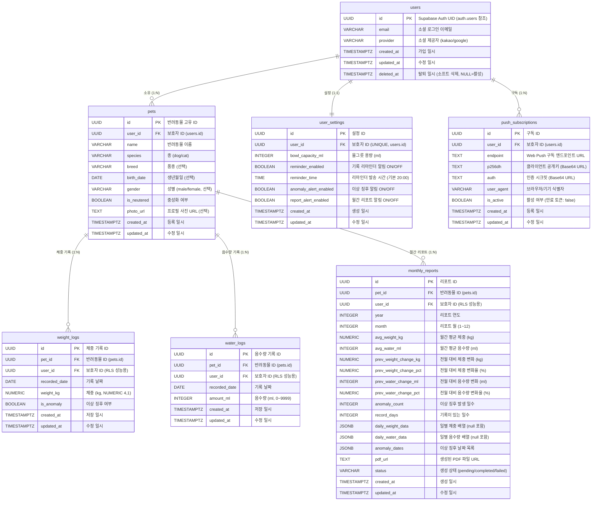
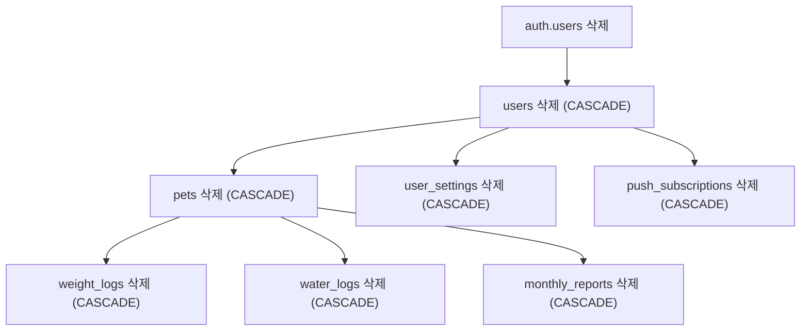

# 데이터베이스 설계서

**프로젝트명**: 반려동물 건강 기록 웹앱
**작성일**: 2026-06-22
**버전**: v1.0
**참조 문서**: 기능명세서.md, API스펙.md, 시스템정의서.md

---

## 1. 개요

### 1.1 목적

본 문서는 반려동물 건강 기록 웹앱의 PostgreSQL(Supabase) 데이터베이스 논리·물리 구조를 정의한다. 개발팀이 테이블 생성, 인덱스 설계, RLS 정책 적용, 마이그레이션 파일 관리 등 DB 구현 작업을 수행하는 기준 문서로 활용한다.

### 1.2 범위

MVP v1.0 범위에서 사용되는 7개 테이블을 대상으로 한다.

| 테이블명 | 역할 |
|----------|------|
| `users` | 보호자 계정 (Supabase Auth 연동) |
| `pets` | 반려동물 프로필 |
| `weight_logs` | 날짜별 체중 기록 |
| `water_logs` | 날짜별 음수량 기록 |
| `monthly_reports` | 월간 건강 리포트 집계 결과 |
| `user_settings` | 사용자별 알림·물그릇 설정 |
| `push_subscriptions` | Web Push 구독 정보 |

### 1.3 DB 환경

| 항목 | 내용 |
|------|------|
| DBMS | PostgreSQL 15 (Supabase 관리형) |
| 호스팅 | Supabase (Cloud) |
| 인증 연동 | Supabase Auth (`auth.users` 스키마) |
| 보안 | Row-Level Security(RLS) 전 테이블 적용 |
| 확장 | `pgcrypto` (gen_random_uuid), `pg_cron` (스케줄 삭제 보조) |
| 연결 풀링 | pgBouncer (Supabase Connection Pooling, Transaction 모드) |
| 타임존 | UTC 기준 TIMESTAMPTZ 저장, 클라이언트에서 로컬 시간 변환 |

---

## 2. ER 다이어그램



---

## 3. 테이블 정의

### 3.1 users (사용자 테이블)

**설명**: Supabase Auth `auth.users`와 1:1로 연동되는 애플리케이션 사용자 테이블. 소셜 로그인 성공 시 신규 레코드가 INSERT된다. 회원 탈퇴는 `deleted_at`에 일시를 기록하는 소프트 삭제 방식으로 처리하며, 탈퇴 후 30일 경과 시 Cron Job이 완전 삭제한다.

#### 컬럼 정의

| 컬럼명 | 타입 | 제약조건 | 기본값 | 설명 |
|--------|------|----------|--------|------|
| `id` | UUID | PK, REFERENCES auth.users(id) ON DELETE CASCADE | - | Supabase Auth UID와 동일한 값 사용 |
| `email` | VARCHAR(255) | NOT NULL | - | 소셜 로그인에서 제공한 이메일 |
| `provider` | VARCHAR(20) | NOT NULL, CHECK IN ('kakao', 'google') | - | 소셜 로그인 제공자 |
| `created_at` | TIMESTAMPTZ | NOT NULL | NOW() | 최초 가입 일시 |
| `updated_at` | TIMESTAMPTZ | NOT NULL | NOW() | 마지막 수정 일시 |
| `deleted_at` | TIMESTAMPTZ | NULL 허용 | NULL | 탈퇴 일시. NULL이면 활성 계정 |

#### 인덱스

| 인덱스명 | 컬럼 | 유형 | 목적 |
|----------|------|------|------|
| `users_pkey` | `id` | PRIMARY KEY | 기본 키 |
| `idx_users_email` | `email` | INDEX | 이메일 조회 성능 |
| `idx_users_deleted_at` | `deleted_at` | INDEX (PARTIAL: WHERE deleted_at IS NOT NULL) | 탈퇴 대상 조회 성능 |

#### RLS 정책

| 정책명 | 동작 | 조건 | 설명 |
|--------|------|------|------|
| `users_select_own` | SELECT | `id = auth.uid()` | 본인 레코드만 조회 가능 |
| `users_update_own` | UPDATE | `id = auth.uid()` | 본인 레코드만 수정 가능 |
| `users_insert_own` | INSERT | `id = auth.uid()` | 본인 레코드만 삽입 가능 (소셜 로그인 시) |
| (DELETE 없음) | DELETE | 불허 | 탈퇴는 소프트 삭제만 허용. 완전 삭제는 Service Role Key 사용 |

---

### 3.2 pets (반려동물 프로필 테이블)

**설명**: 보호자가 등록한 반려동물 프로필. MVP 기준 사용자당 1마리로 제한하나 DB는 1:N 구조를 유지하여 다두 지원(v1.1) 확장에 대비한다. `pets` 레코드 삭제 시 귀속된 기록 및 리포트가 CASCADE 삭제된다.

#### 컬럼 정의

| 컬럼명 | 타입 | 제약조건 | 기본값 | 설명 |
|--------|------|----------|--------|------|
| `id` | UUID | PK | gen_random_uuid() | 반려동물 고유 ID |
| `user_id` | UUID | NOT NULL, FK → users(id) ON DELETE CASCADE | - | 보호자 ID |
| `name` | VARCHAR(100) | NOT NULL | - | 반려동물 이름. 공백 불가 |
| `species` | VARCHAR(10) | NOT NULL, CHECK IN ('dog', 'cat') | - | 종 |
| `breed` | VARCHAR(100) | NULL 허용 | NULL | 품종 |
| `birth_date` | DATE | NULL 허용 | NULL | 생년월일 |
| `gender` | VARCHAR(10) | NULL 허용, CHECK IN ('male', 'female') | NULL | 성별 |
| `is_neutered` | BOOLEAN | NOT NULL | FALSE | 중성화 여부 |
| `photo_url` | TEXT | NULL 허용 | NULL | Supabase Storage 업로드 URL. 미등록 시 종별 기본 이미지 URL 적용 |
| `created_at` | TIMESTAMPTZ | NOT NULL | NOW() | 등록 일시 |
| `updated_at` | TIMESTAMPTZ | NOT NULL | NOW() | 마지막 수정 일시 |

#### 인덱스

| 인덱스명 | 컬럼 | 유형 | 목적 |
|----------|------|------|------|
| `pets_pkey` | `id` | PRIMARY KEY | 기본 키 |
| `idx_pets_user_id` | `user_id` | INDEX | 보호자별 반려동물 목록 조회 성능 |

#### RLS 정책

| 정책명 | 동작 | 조건 | 설명 |
|--------|------|------|------|
| `pets_select_own` | SELECT | `user_id = auth.uid()` | 본인 반려동물만 조회 |
| `pets_insert_own` | INSERT | `user_id = auth.uid()` | 본인 계정으로만 등록 |
| `pets_update_own` | UPDATE | `user_id = auth.uid()` | 본인 반려동물만 수정 |
| `pets_delete_own` | DELETE | `user_id = auth.uid()` | 본인 반려동물만 삭제 |

---

### 3.3 weight_logs (체중 기록 테이블)

**설명**: 날짜별 반려동물 체중 기록. `(pet_id, recorded_date)` 조합에 UNIQUE 제약을 적용하여 하루에 반려동물당 1건만 허용한다. 당일 기록이 이미 존재하면 UPDATE(Upsert)된다. `user_id`는 RLS 정책을 JOIN 없이 적용하기 위해 비정규화하여 저장한다.

#### 컬럼 정의

| 컬럼명 | 타입 | 제약조건 | 기본값 | 설명 |
|--------|------|----------|--------|------|
| `id` | UUID | PK | gen_random_uuid() | 체중 기록 고유 ID |
| `pet_id` | UUID | NOT NULL, FK → pets(id) ON DELETE CASCADE | - | 대상 반려동물 ID |
| `user_id` | UUID | NOT NULL, FK → users(id) ON DELETE CASCADE | - | 보호자 ID (RLS 성능용 비정규화) |
| `recorded_date` | DATE | NOT NULL | - | 기록 날짜 (YYYY-MM-DD) |
| `weight_kg` | NUMERIC(4,1) | NOT NULL, CHECK (weight_kg >= 0.1 AND weight_kg <= 99.9) | - | 체중(kg). 소수점 1자리 |
| `is_anomaly` | BOOLEAN | NOT NULL | FALSE | 이상 징후 여부. 최근 7일 평균 대비 10% 이상 감소 시 true |
| `created_at` | TIMESTAMPTZ | NOT NULL | NOW() | 최초 저장 일시 (오프라인 동기화 Last-Write-Wins 기준) |
| `updated_at` | TIMESTAMPTZ | NOT NULL | NOW() | 마지막 수정 일시 |

#### 인덱스

| 인덱스명 | 컬럼 | 유형 | 목적 |
|----------|------|------|------|
| `weight_logs_pkey` | `id` | PRIMARY KEY | 기본 키 |
| `uq_weight_logs_pet_date` | `(pet_id, recorded_date)` | UNIQUE | 하루 1건 제약, Upsert 기준 |
| `idx_weight_logs_pet_date` | `(pet_id, recorded_date DESC)` | INDEX | 기간별 체중 조회 성능 (차트 렌더링) |
| `idx_weight_logs_user_id` | `user_id` | INDEX | RLS 정책 성능 |

#### RLS 정책

| 정책명 | 동작 | 조건 | 설명 |
|--------|------|------|------|
| `weight_logs_select_own` | SELECT | `user_id = auth.uid()` | 본인 반려동물 기록만 조회 |
| `weight_logs_insert_own` | INSERT | `user_id = auth.uid()` | 본인 반려동물 기록만 등록 |
| `weight_logs_update_own` | UPDATE | `user_id = auth.uid()` | 본인 반려동물 기록만 수정 |
| `weight_logs_delete_own` | DELETE | `user_id = auth.uid()` | 본인 반려동물 기록만 삭제 |

---

### 3.4 water_logs (음수량 기록 테이블)

**설명**: 날짜별 반려동물 음수량 기록. `(pet_id, recorded_date)` UNIQUE 제약으로 하루 1건을 보장한다. `user_id`는 RLS 성능용으로 비정규화 저장한다.

#### 컬럼 정의

| 컬럼명 | 타입 | 제약조건 | 기본값 | 설명 |
|--------|------|----------|--------|------|
| `id` | UUID | PK | gen_random_uuid() | 음수량 기록 고유 ID |
| `pet_id` | UUID | NOT NULL, FK → pets(id) ON DELETE CASCADE | - | 대상 반려동물 ID |
| `user_id` | UUID | NOT NULL, FK → users(id) ON DELETE CASCADE | - | 보호자 ID (RLS 성능용 비정규화) |
| `recorded_date` | DATE | NOT NULL | - | 기록 날짜 (YYYY-MM-DD) |
| `amount_ml` | INTEGER | NOT NULL, CHECK (amount_ml >= 0 AND amount_ml <= 9999) | - | 음수량(ml). 0~9,999 정수 |
| `created_at` | TIMESTAMPTZ | NOT NULL | NOW() | 최초 저장 일시 (오프라인 동기화 Last-Write-Wins 기준) |
| `updated_at` | TIMESTAMPTZ | NOT NULL | NOW() | 마지막 수정 일시 |

#### 인덱스

| 인덱스명 | 컬럼 | 유형 | 목적 |
|----------|------|------|------|
| `water_logs_pkey` | `id` | PRIMARY KEY | 기본 키 |
| `uq_water_logs_pet_date` | `(pet_id, recorded_date)` | UNIQUE | 하루 1건 제약, Upsert 기준 |
| `idx_water_logs_pet_date` | `(pet_id, recorded_date DESC)` | INDEX | 기간별 음수량 조회 성능 |
| `idx_water_logs_user_id` | `user_id` | INDEX | RLS 정책 성능 |

#### RLS 정책

| 정책명 | 동작 | 조건 | 설명 |
|--------|------|------|------|
| `water_logs_select_own` | SELECT | `user_id = auth.uid()` | 본인 반려동물 기록만 조회 |
| `water_logs_insert_own` | INSERT | `user_id = auth.uid()` | 본인 반려동물 기록만 등록 |
| `water_logs_update_own` | UPDATE | `user_id = auth.uid()` | 본인 반려동물 기록만 수정 |
| `water_logs_delete_own` | DELETE | `user_id = auth.uid()` | (현재 API 미구현, 향후 대비) |

---

### 3.5 monthly_reports (월간 리포트 테이블)

**설명**: Vercel Cron Job이 매월 1일 자동으로 생성하는 전월 건강 집계 데이터. 일별 데이터는 JSONB 배열로 저장하며 기록이 없는 날은 `null`로 처리한다. INSERT는 Service Role Key를 사용하는 Cron Job만 허용하고 일반 사용자는 SELECT만 가능하다.

#### 컬럼 정의

| 컬럼명 | 타입 | 제약조건 | 기본값 | 설명 |
|--------|------|----------|--------|------|
| `id` | UUID | PK | gen_random_uuid() | 리포트 고유 ID |
| `pet_id` | UUID | NOT NULL, FK → pets(id) ON DELETE CASCADE | - | 대상 반려동물 ID |
| `user_id` | UUID | NOT NULL, FK → users(id) ON DELETE CASCADE | - | 보호자 ID (RLS 성능용 비정규화) |
| `year` | INTEGER | NOT NULL, CHECK (year >= 2024) | - | 리포트 연도 |
| `month` | INTEGER | NOT NULL, CHECK (month >= 1 AND month <= 12) | - | 리포트 월 |
| `avg_weight_kg` | NUMERIC(5,2) | NULL 허용 | NULL | 월간 평균 체중(kg). 기록 없으면 NULL |
| `avg_water_ml` | INTEGER | NULL 허용 | NULL | 월간 평균 음수량(ml). 기록 없으면 NULL |
| `prev_weight_change_kg` | NUMERIC(5,2) | NULL 허용 | NULL | 전월 대비 체중 변화(kg) |
| `prev_weight_change_pct` | NUMERIC(5,2) | NULL 허용 | NULL | 전월 대비 체중 변화율(%) |
| `prev_water_change_ml` | INTEGER | NULL 허용 | NULL | 전월 대비 음수량 변화(ml) |
| `prev_water_change_pct` | NUMERIC(5,2) | NULL 허용 | NULL | 전월 대비 음수량 변화율(%) |
| `anomaly_count` | INTEGER | NOT NULL | 0 | 이상 징후 발생 일수 |
| `record_days` | INTEGER | NOT NULL | 0 | 기록이 있는 일수 |
| `daily_weight_data` | JSONB | NULL 허용 | NULL | 일별 체중 배열. 예: `[{"date":"2026-05-01","weight_kg":4.3},{"date":"2026-05-02","weight_kg":null}]` |
| `daily_water_data` | JSONB | NULL 허용 | NULL | 일별 음수량 배열. 예: `[{"date":"2026-05-01","amount_ml":300}]` |
| `anomaly_dates` | JSONB | NOT NULL | '[]' | 이상 징후 발생 날짜 목록. 예: `["2026-05-15","2026-05-16"]` |
| `pdf_url` | TEXT | NULL 허용 | NULL | 생성된 PDF의 Supabase Storage URL |
| `status` | VARCHAR(20) | NOT NULL, CHECK IN ('pending', 'completed', 'failed') | 'pending' | 리포트 생성 상태 |
| `created_at` | TIMESTAMPTZ | NOT NULL | NOW() | 리포트 생성 일시 |
| `updated_at` | TIMESTAMPTZ | NOT NULL | NOW() | 마지막 수정 일시 |

#### 인덱스

| 인덱스명 | 컬럼 | 유형 | 목적 |
|----------|------|------|------|
| `monthly_reports_pkey` | `id` | PRIMARY KEY | 기본 키 |
| `uq_monthly_reports_pet_year_month` | `(pet_id, year, month)` | UNIQUE | 반려동물당 월 1건 제약 |
| `idx_monthly_reports_pet_id` | `(pet_id, year DESC, month DESC)` | INDEX | 리포트 목록 조회 성능 (최신 월 우선) |
| `idx_monthly_reports_user_id` | `user_id` | INDEX | RLS 정책 성능 |
| `idx_monthly_reports_status` | `status` | INDEX (PARTIAL: WHERE status = 'pending') | Cron Job 재처리 대상 조회 |

#### RLS 정책

| 정책명 | 동작 | 조건 | 설명 |
|--------|------|------|------|
| `monthly_reports_select_own` | SELECT | `user_id = auth.uid()` | 본인 리포트만 조회 가능 |
| (INSERT 없음) | INSERT | Service Role Key 전용 | 일반 사용자 직접 생성 불가. Cron Job만 Service Role로 INSERT |
| (UPDATE 없음) | UPDATE | Service Role Key 전용 | PDF URL, status 변경은 Cron Job만 허용 |
| (DELETE 없음) | DELETE | 불허 (CASCADE에 의해 처리) | 직접 삭제 불가. pets 삭제 시 CASCADE로 자동 삭제 |

---

### 3.6 user_settings (사용자 설정 테이블)

**설명**: 사용자별 알림 설정 및 물그릇 용량 설정. `user_id`에 UNIQUE 제약을 적용하여 계정당 1행을 보장한다. 소셜 로그인 시 기본값으로 자동 INSERT된다.

#### 컬럼 정의

| 컬럼명 | 타입 | 제약조건 | 기본값 | 설명 |
|--------|------|----------|--------|------|
| `id` | UUID | PK | gen_random_uuid() | 설정 고유 ID |
| `user_id` | UUID | NOT NULL, UNIQUE, FK → users(id) ON DELETE CASCADE | - | 보호자 ID (1:1 관계) |
| `bowl_capacity_ml` | INTEGER | NULL 허용, CHECK (bowl_capacity_ml > 0) | NULL | 물그릇 용량(ml). 미설정 시 역산 모드 비활성화 |
| `reminder_enabled` | BOOLEAN | NOT NULL | TRUE | 기록 리마인더 알림 ON/OFF |
| `reminder_time` | TIME | NOT NULL | '20:00:00' | 리마인더 발송 시간 (HH:MM, 사용자 로컬 기준) |
| `anomaly_alert_enabled` | BOOLEAN | NOT NULL | TRUE | 이상 징후 알림 ON/OFF |
| `report_alert_enabled` | BOOLEAN | NOT NULL | TRUE | 월간 리포트 완성 알림 ON/OFF |
| `created_at` | TIMESTAMPTZ | NOT NULL | NOW() | 설정 최초 생성 일시 |
| `updated_at` | TIMESTAMPTZ | NOT NULL | NOW() | 마지막 수정 일시 |

#### 인덱스

| 인덱스명 | 컬럼 | 유형 | 목적 |
|----------|------|------|------|
| `user_settings_pkey` | `id` | PRIMARY KEY | 기본 키 |
| `uq_user_settings_user_id` | `user_id` | UNIQUE | 계정당 1행 보장 |
| `idx_user_settings_reminder` | `(reminder_enabled, reminder_time)` | INDEX (PARTIAL: WHERE reminder_enabled = TRUE) | 리마인더 발송 대상 조회 성능 (Cron Job) |

#### RLS 정책

| 정책명 | 동작 | 조건 | 설명 |
|--------|------|------|------|
| `user_settings_select_own` | SELECT | `user_id = auth.uid()` | 본인 설정만 조회 |
| `user_settings_insert_own` | INSERT | `user_id = auth.uid()` | 본인 설정만 생성 |
| `user_settings_update_own` | UPDATE | `user_id = auth.uid()` | 본인 설정만 수정 |
| `user_settings_delete_own` | DELETE | `user_id = auth.uid()` | (탈퇴 시 CASCADE 삭제, 직접 삭제는 미사용) |

---

### 3.7 push_subscriptions (Web Push 구독 테이블)

**설명**: Web Push API 구독 정보를 저장한다. 사용자가 여러 기기·브라우저에서 구독할 수 있으므로 `user_id`와 1:N 관계다. 만료되거나 무효화된 구독은 `is_active = false`로 비활성화한다.

#### 컬럼 정의

| 컬럼명 | 타입 | 제약조건 | 기본값 | 설명 |
|--------|------|----------|--------|------|
| `id` | UUID | PK | gen_random_uuid() | 구독 고유 ID |
| `user_id` | UUID | NOT NULL, FK → users(id) ON DELETE CASCADE | - | 보호자 ID |
| `endpoint` | TEXT | NOT NULL | - | Web Push 구독 엔드포인트 URL |
| `p256dh` | TEXT | NOT NULL | - | 클라이언트 공개키 (Base64 URL 인코딩) |
| `auth` | TEXT | NOT NULL | - | 인증 시크릿 (Base64 URL 인코딩) |
| `user_agent` | VARCHAR(500) | NULL 허용 | NULL | 브라우저/기기 식별자 |
| `is_active` | BOOLEAN | NOT NULL | TRUE | 활성 여부. 발송 실패 시 false로 업데이트 |
| `created_at` | TIMESTAMPTZ | NOT NULL | NOW() | 구독 등록 일시 |
| `updated_at` | TIMESTAMPTZ | NOT NULL | NOW() | 마지막 수정 일시 |

#### 인덱스

| 인덱스명 | 컬럼 | 유형 | 목적 |
|----------|------|------|------|
| `push_subscriptions_pkey` | `id` | PRIMARY KEY | 기본 키 |
| `uq_push_subscriptions_endpoint` | `endpoint` | UNIQUE | 동일 엔드포인트 중복 등록 방지 |
| `idx_push_subscriptions_user_active` | `(user_id, is_active)` | INDEX | 사용자별 활성 구독 조회 성능 (Push 발송) |

#### RLS 정책

| 정책명 | 동작 | 조건 | 설명 |
|--------|------|------|------|
| `push_subscriptions_select_own` | SELECT | `user_id = auth.uid()` | 본인 구독 정보만 조회 |
| `push_subscriptions_insert_own` | INSERT | `user_id = auth.uid()` | 본인 구독만 등록 |
| `push_subscriptions_update_own` | UPDATE | `user_id = auth.uid()` | 본인 구독만 수정 |
| `push_subscriptions_delete_own` | DELETE | `user_id = auth.uid()` | 본인 구독만 삭제 |

---

## 4. 관계 정의

### 4.1 FK 관계 요약

| 테이블 | 컬럼 | 참조 테이블.컬럼 | ON DELETE | ON UPDATE |
|--------|------|-----------------|-----------|-----------|
| `pets` | `user_id` | `users.id` | CASCADE | CASCADE |
| `weight_logs` | `pet_id` | `pets.id` | CASCADE | CASCADE |
| `weight_logs` | `user_id` | `users.id` | CASCADE | CASCADE |
| `water_logs` | `pet_id` | `pets.id` | CASCADE | CASCADE |
| `water_logs` | `user_id` | `users.id` | CASCADE | CASCADE |
| `monthly_reports` | `pet_id` | `pets.id` | CASCADE | CASCADE |
| `monthly_reports` | `user_id` | `users.id` | CASCADE | CASCADE |
| `user_settings` | `user_id` | `users.id` | CASCADE | CASCADE |
| `push_subscriptions` | `user_id` | `users.id` | CASCADE | CASCADE |
| `users` | `id` | `auth.users.id` | CASCADE | CASCADE |

### 4.2 CASCADE 삭제 연쇄 경로



**반려동물 프로필 삭제 시**: `pets` 삭제 → `weight_logs`, `water_logs`, `monthly_reports` CASCADE 삭제

**회원 탈퇴 완전 삭제 시**: `users` 삭제 → `pets`, `user_settings`, `push_subscriptions` CASCADE 삭제 → 이하 연쇄 삭제

---

## 5. 인덱스 설계 전략

### 5.1 설계 원칙

| 원칙 | 내용 |
|------|------|
| RLS 전용 인덱스 | `user_id` 컬럼에 단독 인덱스를 추가하여 RLS 정책 평가 시 시퀀셜 스캔을 방지한다 |
| 기간 조회 최적화 | `(pet_id, recorded_date DESC)` 복합 인덱스로 날짜 내림차순 체중·음수량 조회를 인덱스 스캔으로 처리한다 |
| UNIQUE 제약 = 인덱스 | `(pet_id, recorded_date)` UNIQUE 제약은 내부적으로 B-Tree 인덱스를 생성하므로 별도 일반 인덱스를 추가하지 않는다 |
| 부분 인덱스(Partial Index) | `is_active = FALSE`, `deleted_at IS NOT NULL`, `status = 'pending'` 등 조건부 조회가 빈번한 컬럼에 부분 인덱스를 적용하여 인덱스 크기를 최소화한다 |

### 5.2 전체 인덱스 목록

| 테이블 | 인덱스명 | 컬럼 | 유형 | 비고 |
|--------|----------|------|------|------|
| `users` | `users_pkey` | `id` | PK | - |
| `users` | `idx_users_email` | `email` | B-Tree | - |
| `users` | `idx_users_deleted_at` | `deleted_at` | Partial (IS NOT NULL) | 탈퇴 대상 Cron 조회 |
| `pets` | `pets_pkey` | `id` | PK | - |
| `pets` | `idx_pets_user_id` | `user_id` | B-Tree | RLS 성능 |
| `weight_logs` | `weight_logs_pkey` | `id` | PK | - |
| `weight_logs` | `uq_weight_logs_pet_date` | `(pet_id, recorded_date)` | UNIQUE | 하루 1건 보장 |
| `weight_logs` | `idx_weight_logs_pet_date` | `(pet_id, recorded_date DESC)` | B-Tree | 기간 조회 성능 |
| `weight_logs` | `idx_weight_logs_user_id` | `user_id` | B-Tree | RLS 성능 |
| `water_logs` | `water_logs_pkey` | `id` | PK | - |
| `water_logs` | `uq_water_logs_pet_date` | `(pet_id, recorded_date)` | UNIQUE | 하루 1건 보장 |
| `water_logs` | `idx_water_logs_pet_date` | `(pet_id, recorded_date DESC)` | B-Tree | 기간 조회 성능 |
| `water_logs` | `idx_water_logs_user_id` | `user_id` | B-Tree | RLS 성능 |
| `monthly_reports` | `monthly_reports_pkey` | `id` | PK | - |
| `monthly_reports` | `uq_monthly_reports_pet_year_month` | `(pet_id, year, month)` | UNIQUE | 월 1건 보장 |
| `monthly_reports` | `idx_monthly_reports_pet_id` | `(pet_id, year DESC, month DESC)` | B-Tree | 목록 조회 성능 |
| `monthly_reports` | `idx_monthly_reports_user_id` | `user_id` | B-Tree | RLS 성능 |
| `monthly_reports` | `idx_monthly_reports_status` | `status` | Partial (= 'pending') | Cron Job 재처리 조회 |
| `user_settings` | `user_settings_pkey` | `id` | PK | - |
| `user_settings` | `uq_user_settings_user_id` | `user_id` | UNIQUE | 1:1 보장 |
| `user_settings` | `idx_user_settings_reminder` | `(reminder_enabled, reminder_time)` | Partial (reminder_enabled = TRUE) | 리마인더 Cron 조회 |
| `push_subscriptions` | `push_subscriptions_pkey` | `id` | PK | - |
| `push_subscriptions` | `uq_push_subscriptions_endpoint` | `endpoint` | UNIQUE | 중복 구독 방지 |
| `push_subscriptions` | `idx_push_subscriptions_user_active` | `(user_id, is_active)` | B-Tree | Push 발송 대상 조회 |

### 5.3 파티셔닝 고려

MVP 기준(MAU 5,000, 1인 1마리)에서는 `weight_logs` 최대 예상 레코드 수가 약 1,825,000건(5,000 × 365일)으로 파티셔닝이 불필요하다. v2.0(MAU 50,000 이상, 다두 지원) 시점에 `recorded_date` 기준 월별 Range Partitioning 도입을 검토한다.

---

## 6. 데이터 보존 정책

### 6.1 삭제 방식 구분

| 대상 | 삭제 방식 | 상세 |
|------|----------|------|
| 회원 탈퇴 | 소프트 삭제 → 완전 삭제 | `users.deleted_at` 기록 후 30일 경과 시 Cron Job이 완전 삭제 |
| 반려동물 프로필 삭제 | 즉시 하드 삭제 + CASCADE | `pets` 레코드 삭제 시 `weight_logs`, `water_logs`, `monthly_reports` CASCADE 삭제 |
| 체중·음수량 개별 기록 삭제 | 즉시 하드 삭제 | 사용자 요청 시 즉시 삭제, 복구 불가 |
| 월간 리포트 | CASCADE에 의해서만 삭제 | 직접 삭제 API 없음. pets 또는 users 삭제 시 CASCADE |
| 비활성 Push 구독 | `is_active = false` 비활성화 | 완전 삭제는 사용자 탈퇴 시 CASCADE |

### 6.2 탈퇴 후 데이터 처리 흐름

| 단계 | 처리 내용 |
|------|----------|
| 1단계 (탈퇴 즉시) | `users.deleted_at = NOW()` 기록, Supabase Auth 계정 비활성화, RLS에 의해 로그인 불가 |
| 2단계 (탈퇴 후 30일 이내) | 데이터 보존. RLS로 접근 불가 상태 유지 |
| 3단계 (탈퇴 후 30일 경과) | Vercel Cron Job이 `deleted_at + 30일 < NOW()` 조건의 `users` 레코드 완전 삭제. CASCADE로 모든 관련 데이터 삭제 |

### 6.3 Soft Delete 대상 여부

| 테이블 | Soft Delete | 이유 |
|--------|-------------|------|
| `users` | 적용 (`deleted_at`) | 탈퇴 후 30일 보존 정책(NFR-008) 준수 |
| `pets` | 미적용 | 즉시 삭제. 보호자가 의도적으로 삭제한 데이터는 복구 불필요 |
| `weight_logs` | 미적용 | pets CASCADE로 처리. 개별 삭제 시 즉시 삭제 |
| `water_logs` | 미적용 | pets CASCADE로 처리 |
| `monthly_reports` | 미적용 | pets CASCADE로 처리 |
| `user_settings` | 미적용 | users CASCADE로 처리 |
| `push_subscriptions` | 부분 적용 (`is_active = false`) | 토큰 만료 구독은 즉시 삭제하지 않고 비활성화하여 동일 엔드포인트 재구독 식별에 활용 |

---

## 7. 마이그레이션 전략

### 7.1 Supabase Migration 파일 명명 규칙

Supabase CLI `supabase migration new <description>` 명령으로 생성되는 파일을 기준으로 한다.

```
supabase/migrations/
├── 20260601000001_create_users.sql
├── 20260601000002_create_pets.sql
├── 20260601000003_create_weight_logs.sql
├── 20260601000004_create_water_logs.sql
├── 20260601000005_create_monthly_reports.sql
├── 20260601000006_create_user_settings.sql
├── 20260601000007_create_push_subscriptions.sql
├── 20260601000008_create_indexes.sql
├── 20260601000009_create_rls_policies.sql
└── 20260601000010_create_triggers.sql
```

**파일명 형식**: `{YYYYMMDDHHMMSS}_{동작}_{대상}.sql`

### 7.2 마이그레이션 순서 및 의존관계

| 순서 | 파일명 접미사 | 내용 | 선행 조건 |
|------|-------------|------|----------|
| 1 | `create_users` | `users` 테이블 생성 | Supabase Auth 프로젝트 설정 완료 |
| 2 | `create_pets` | `pets` 테이블 생성 | `users` 완료 |
| 3 | `create_weight_logs` | `weight_logs` 테이블 생성 | `pets` 완료 |
| 4 | `create_water_logs` | `water_logs` 테이블 생성 | `pets` 완료 |
| 5 | `create_monthly_reports` | `monthly_reports` 테이블 생성 | `pets` 완료 |
| 6 | `create_user_settings` | `user_settings` 테이블 생성 | `users` 완료 |
| 7 | `create_push_subscriptions` | `push_subscriptions` 테이블 생성 | `users` 완료 |
| 8 | `create_indexes` | 전체 인덱스 생성 | 7개 테이블 생성 완료 |
| 9 | `create_rls_policies` | 전체 RLS 정책 활성화 | 7개 테이블 생성 완료 |
| 10 | `create_triggers` | `updated_at` 자동 갱신 트리거 | 7개 테이블 생성 완료 |

### 7.3 updated_at 자동 갱신 트리거

모든 테이블의 `updated_at` 컬럼은 아래 트리거 함수로 자동 갱신한다.

```sql
-- 트리거 함수 정의
CREATE OR REPLACE FUNCTION update_updated_at_column()
RETURNS TRIGGER AS $$
BEGIN
    NEW.updated_at = NOW();
    RETURN NEW;
END;
$$ LANGUAGE plpgsql;

-- 각 테이블에 트리거 적용 예시 (users)
CREATE TRIGGER set_updated_at
    BEFORE UPDATE ON users
    FOR EACH ROW EXECUTE FUNCTION update_updated_at_column();
```

대상 테이블: `users`, `pets`, `weight_logs`, `water_logs`, `monthly_reports`, `user_settings`, `push_subscriptions`

### 7.4 롤백 전략

| 항목 | 내용 |
|------|------|
| 롤백 파일 | 각 마이그레이션 파일과 동일한 번호로 `_rollback.sql` 파일을 별도 관리 |
| 롤백 범위 | DROP TABLE, DROP INDEX, DROP POLICY 순으로 역순 실행 |
| 스테이징 검증 | 프로덕션 적용 전 Supabase 스테이징 프로젝트에서 마이그레이션 → 롤백 순으로 검증 의무화 |
| 데이터 마이그레이션 | 컬럼 추가·변경은 `ALTER TABLE`로 처리하며, 기존 데이터 변환이 필요한 경우 별도 데이터 마이그레이션 스크립트 작성 |

---

**작성 완료 여부**: [x] 데이터베이스설계서 작성 완료 (2026-06-22)
