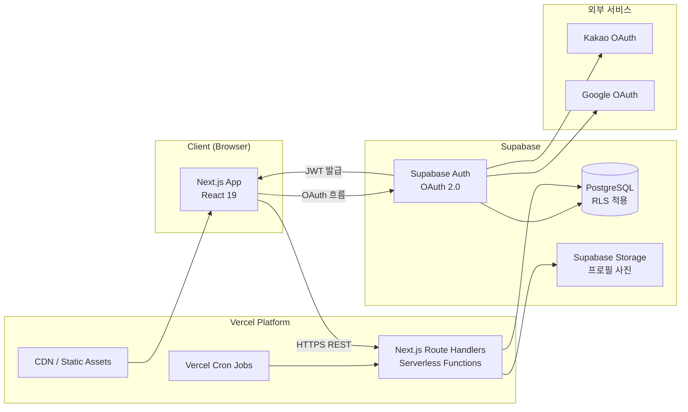
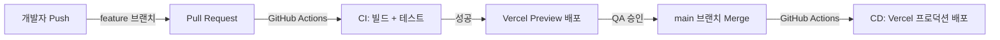

# 시스템 정의서

**프로젝트명**: 반려동물 건강 기록 웹앱
**작성일**: 2026-06-19
**버전**: v1.1
**참조 문서**: 기능명세서.md, 요구사항정의서.md, PRD.md

> **변경 이력**
> | 버전 | 일자 | 변경 내용 |
> |------|------|-----------|
> | v1.0 | 2026-06-19 | 최초 작성 |
> | v1.1 | 2026-06-29 | 오프라인 지원(Service Worker/IndexedDB), PDF 생성(Puppeteer), Web Push 알림(VAPID) → v1.1 추후 구현. React+Vite → Next.js 16 App Router로 기술 스택 반영 수정 |

---

## 1. 시스템 개요

### 1.1 서비스 목적

반려동물을 키우는 보호자가 데일리 체중·음수량을 간편하게 기록하고, 월간 건강 리포트를 통해 장기적인 건강 추이를 확인할 수 있는 웹앱 서비스. PDF 내보내기 및 Web Push 알림은 v1.1에서 구현 예정이다.

### 1.2 아키텍처 방향

| 방향 | 내용 |
|------|------|
| 단일 배포 플랫폼 | 프론트엔드(Next.js)와 백엔드 API Route Handlers를 Vercel에서 통합 배포. 별도 서버 운영 없음 |
| BaaS 활용 | 인증·DB·스토리지·RLS를 Supabase로 위임하여 백엔드 구현 범위 최소화 |
| Serverless Cron | 월간 리포트 자동 생성을 Vercel Cron Jobs로 처리 (리마인더 알림은 v1.1 추후 구현) |
| API 설계 | REST API, JSON 응답, 전 구간 HTTPS 의무화 |
| PWA | v1.1 추후 구현 (Service Worker + IndexedDB 오프라인 지원) |

### 1.3 주요 제약 조건

| 제약 항목 | 내용 |
|-----------|------|
| 앱스토어 배포 없음 | 브라우저 기반 웹앱으로만 제공 (PWA 설치는 v1.1 추후 구현) |
| Vercel Function 타임아웃 | 기본 10초. Next.js Route Handlers 기준 (PDF 생성은 v1.1 이후 검토) |
| Push 알림 | v1.1 추후 구현. v1.0은 앱 내 이상 징후 토스트만 제공 |
| Supabase 무료 플랜 | 스토리지 1GB, DB 500MB, 월간 활성 사용자 50,000 제한 (실습 목적 대비 충분) |
| 소셜 로그인 범위 | v1.0: 카카오·구글 지원. 애플 로그인은 v1.1 이후 검토 |

---

## 2. 시스템 아키텍처

### 2.1 전체 컴포넌트 다이어그램

> **v1.1 추후 추가 예정**: Service Worker(오프라인), PDF Generator(Puppeteer), Web Push(VAPID/FCM)

### 2.2 Web Push 알림 흐름 [v1.1 추후 구현]

> VAPID 기반 Web Push 알림 흐름. v1.1에서 구현 예정. v1.0에서는 앱 내 토스트로 이상 징후 경고를 표시한다.

### 2.3 오프라인 동기화 흐름 [v1.1 추후 구현]

> Service Worker + IndexedDB + Background Sync 기반 오프라인 동기화. v1.1에서 구현 예정. v1.0에서는 오프라인 상태에서 기록 불가.

---

## 3. 컴포넌트 정의

| 컴포넌트명 | 기술 | 역할 | 비고 |
|-----------|------|------|------|
| Next.js App | Next.js 16 App Router + React 19 | UI 렌더링, 파일 기반 라우팅, 상태 관리 | Recharts 구현 시 설치 예정 |
| Next.js Route Handlers | Next.js API Routes (Vercel Serverless) | REST API 엔드포인트 처리, 비즈니스 로직 | Vercel `/api` 라우트 자동 배포 |
| Supabase Auth | Supabase Auth (OAuth 2.0) | 카카오·구글 소셜 로그인, JWT 발급·갱신 | JWT 만료 7일, Refresh Token |
| PostgreSQL | Supabase (PostgreSQL) | 사용자·반려동물·기록·리포트 데이터 영속 저장 | RLS 전 테이블 적용 |
| Supabase Storage | Supabase Storage | 반려동물 프로필 사진 파일 저장 | JPG/PNG, CDN 제공 |
| Vercel Cron Jobs | Vercel Cron | 월간 리포트 자동 생성 (리마인더 알림은 v1.1 추후 구현) | UTC 기준 cron 표현식 |
| GitHub Actions | GitHub Actions | CI/CD 파이프라인 (빌드·테스트·Vercel 배포) | main 브랜치 푸시 트리거 |
| Service Worker | Web API (Workbox) | **[v1.1 추후 구현]** 오프라인 캐싱, Background Sync, Push 구독 | - |
| IndexedDB | Web API (idb 라이브러리) | **[v1.1 추후 구현]** 오프라인 임시 데이터 저장 | - |
| PDF Generator | Puppeteer / html2pdf | **[v1.1 추후 구현]** 서버사이드 리포트 PDF 변환 | - |
| Web Push | VAPID 방식 (web-push 라이브러리) | **[v1.1 추후 구현]** 리마인더·이상징후·리포트 알림 | - |

---

## 4. 데이터 흐름

### 4.1 데일리 기록 저장 (온라인)

| 단계 | 주체 | 동작 |
|------|------|------|
| 1 | 클라이언트 | 체중 또는 음수량 입력값 유효성 검사 (범위, 형식) |
| 2 | 클라이언트 | `Authorization: Bearer <JWT>` 헤더 포함 POST 요청 |
| 3 | Express.js API | JWT 유효성 미들웨어 검증 |
| 4 | Express.js API | Supabase DB UPSERT (당일 기록 존재 시 UPDATE, 없으면 INSERT) |
| 5 | PostgreSQL (RLS) | `user_id = auth.uid()` 정책으로 소유자 검증 후 저장 |
| 6 | Express.js API | 저장 성공 응답 반환 (목표 ≤ 1초) |
| 7 | 클라이언트 | 홈 화면 차트 즉시 갱신, 전일 대비 변화량 업데이트 |
| 8 | Next.js Route Handler (비동기) | 이상 징후 감지 검사 수행 (F-005-B), 임계값 초과 시 앱 내 토스트용 플래그 반환 (Web Push는 v1.1 추후 구현) |

### 4.2 월간 리포트 자동 생성

| 단계 | 주체 | 동작 |
|------|------|------|
| 1 | Vercel Cron | 매월 1일 00:00 UTC에 `/api/cron/monthly-report` 엔드포인트 호출 |
| 2 | Next.js Route Handler | 활성 사용자 목록 조회 (`users` 테이블, `deleted_at IS NULL`) |
| 3 | Next.js Route Handler | 사용자별 전월 체중·음수량 집계 (평균, 이상 징후 날짜 목록) |
| 4 | PostgreSQL | `monthly_reports` 테이블에 집계 결과 INSERT |
| 5 | 예외 처리 | 전월 기록 0건 시 "기록 없음" 상태 리포트 생성 / 오류 시 최대 3회 재시도 |

> 리포트 생성 완료 알림(Web Push) 및 오전 9~10시 무작위 발송은 v1.1 추후 구현.

### 4.3 오프라인 기록 및 자동 동기화 [v1.1 추후 구현]

> Service Worker + IndexedDB 기반 오프라인 동기화. v1.1에서 구현 예정.
> v1.0에서 오프라인 상태로 기록 시 일반 네트워크 오류 토스트가 표시된다.

### 4.4 PDF 리포트 내보내기 [v1.1 추후 구현]

> Puppeteer/html2pdf 기반 서버사이드 PDF 생성. v1.1에서 구현 예정.

---

## 5. DB 테이블 정의

| 테이블명 | 주요 컬럼 | 설명 | RLS 적용 |
|---------|-----------|------|----------|
| `users` | `id` (UUID, PK), `email`, `provider` (kakao/google), `created_at`, `deleted_at` | Supabase Auth와 연동된 사용자 계정. `deleted_at` 소프트 삭제 (탈퇴 후 30일 보존) | 적용 (`id = auth.uid()`) |
| `pets` | `id` (UUID, PK), `user_id` (FK), `name`, `species` (dog/cat), `breed`, `birth_date`, `gender`, `neutered`, `photo_url`, `created_at` | 반려동물 프로필. `user_id`로 보호자와 연결 | 적용 (`user_id = auth.uid()`) |
| `weight_logs` | `id` (UUID, PK), `pet_id` (FK), `user_id` (FK), `log_date` (DATE), `weight_kg` (NUMERIC 4,1), `created_at` | 날짜별 체중 기록. (pet_id, log_date) UNIQUE 제약 (당일 1건) | 적용 (`user_id = auth.uid()`) |
| `water_logs` | `id` (UUID, PK), `pet_id` (FK), `user_id` (FK), `log_date` (DATE), `amount_ml` (INTEGER), `created_at` | 날짜별 음수량 기록. (pet_id, log_date) UNIQUE 제약 (당일 1건) | 적용 (`user_id = auth.uid()`) |
| `monthly_reports` | `id` (UUID, PK), `pet_id` (FK), `user_id` (FK), `year` (INTEGER), `month` (INTEGER), `avg_weight_kg`, `avg_water_ml`, `prev_weight_diff`, `prev_water_diff`, `daily_weight_data` (JSONB), `daily_water_data` (JSONB), `anomaly_dates` (JSONB), `created_at` | Vercel Cron이 매월 1일 자동 생성하는 집계 리포트. 일별 데이터는 JSONB 배열로 저장 | 적용 (`user_id = auth.uid()`) |
| `user_settings` | `id` (UUID, PK), `user_id` (FK, UNIQUE), `reminder_time` (TIME, 기본값 20:00), `reminder_enabled` (BOOLEAN), `anomaly_alert_enabled` (BOOLEAN), `report_alert_enabled` (BOOLEAN), `water_bowl_capacity_ml` (INTEGER), `updated_at` | 사용자별 알림 설정 및 물그릇 용량. 계정당 1행 | 적용 (`user_id = auth.uid()`) |
| `push_subscriptions` | `id` (UUID, PK), `user_id` (FK), `endpoint` (TEXT), `p256dh` (TEXT), `auth_key` (TEXT), `is_active` (BOOLEAN), `created_at`, `updated_at` | **[v1.1 추후 구현]** Web Push 구독 토큰 관리. 테이블은 DB에 존재하나 v1.0에서 미사용 | 적용 (`user_id = auth.uid()`) |

---

## 6. 보안 정책

### 6.1 인증 및 세션 관리

| 항목 | 정책 |
|------|------|
| 로그인 방식 | Supabase Auth OAuth 2.0 (카카오, 구글) |
| Access Token | JWT, 만료 7일, `Authorization: Bearer` 헤더 전달 |
| Refresh Token | Supabase Auth 자동 관리. 만료 또는 미존재 시 로그인 화면 이동 |
| 토큰 저장 | 브라우저 `localStorage` (XSS 방어를 위해 Content Security Policy 적용) |
| 로그아웃 | Supabase Auth `signOut()` 호출 + `localStorage` 토큰 삭제 |
| 세션 만료 | Refresh Token 만료 시 자동 로그아웃 및 안내 메시지 표시 |

### 6.2 데이터베이스 Row-Level Security (RLS)

| 테이블 | RLS 정책 | 조건 |
|--------|----------|------|
| `users` | SELECT, UPDATE 허용 | `id = auth.uid()` |
| `pets` | 전체 CRUD 허용 | `user_id = auth.uid()` |
| `weight_logs` | 전체 CRUD 허용 | `user_id = auth.uid()` |
| `water_logs` | 전체 CRUD 허용 | `user_id = auth.uid()` |
| `monthly_reports` | SELECT 허용 (INSERT는 서비스 롤만 허용) | `user_id = auth.uid()` |
| `user_settings` | 전체 CRUD 허용 | `user_id = auth.uid()` |
| `push_subscriptions` | 전체 CRUD 허용 | `user_id = auth.uid()` |

> Vercel Cron이 집계 작업 시 서비스 롤(Service Role Key)을 사용하며, 해당 키는 서버 환경 변수에만 보관하고 클라이언트에 노출하지 않는다.

### 6.3 전송 보안

- 전 구간 HTTPS 의무화 (TLS 1.2 이상)
- HTTP 요청은 Vercel 및 Supabase Edge에서 HTTPS로 자동 리디렉션
- CORS 정책: 허용 오리진을 프로덕션 도메인으로 제한

### 6.4 데이터 보존 및 삭제 정책

| 이벤트 | 처리 방식 | 보존 기간 |
|--------|----------|----------|
| 회원 탈퇴 | `users.deleted_at` 소프트 삭제, Auth 계정 비활성화 | 30일 |
| 탈퇴 후 30일 경과 | Cron이 `deleted_at + 30일` 초과 레코드 완전 삭제 (CASCADE) | 즉시 삭제 |
| 반려동물 프로필 삭제 | 귀속 체중·음수량·리포트 CASCADE 삭제 | 즉시 삭제 |

### 6.5 Content Security Policy

- `default-src 'self'`
- Supabase API, Kakao/Google OAuth 도메인 허용 목록 등록
- `unsafe-eval` 비허용 (React 프로덕션 빌드 기준)

---

## 7. 배포 환경

| 환경 | 목적 | 도메인 | 브랜치 | DB |
|------|------|--------|--------|----|
| 개발 (Local) | 로컬 개발 및 단위 테스트 | `http://localhost:3000` (Next.js 기본 포트) | 개인 feature 브랜치 | Supabase 개발 프로젝트 |
| 스테이징 (Preview) | 통합 테스트 및 QA | Vercel Preview URL (자동 생성) | `develop` 브랜치 PR | Supabase 개발 프로젝트 |
| 프로덕션 | 실서비스 운영 | `https://<서비스-도메인>.vercel.app` | `main` 브랜치 | Supabase 프로덕션 프로젝트 |

### 7.1 환경 변수 관리

| 변수명 | 사용 환경 | 설명 |
|--------|----------|------|
| `NEXT_PUBLIC_SUPABASE_URL` | 클라이언트 | Supabase 프로젝트 API URL (Next.js 공개 변수) |
| `NEXT_PUBLIC_SUPABASE_ANON_KEY` | 클라이언트 | Supabase 익명 키 (공개 가능) |
| `SUPABASE_SERVICE_ROLE_KEY` | 서버 전용 | Supabase 서비스 롤 키 (비공개, Cron 전용) |
| `CRON_SECRET` | 서버 전용 | Cron 엔드포인트 인증 시크릿 |
| `VAPID_PUBLIC_KEY` | 클라이언트 | **[v1.1 추후 구현]** Web Push VAPID 공개 키 |
| `VAPID_PRIVATE_KEY` | 서버 전용 | **[v1.1 추후 구현]** Web Push VAPID 비공개 키 |
| `VAPID_SUBJECT` | 서버 | **[v1.1 추후 구현]** Push 서버 연락처 (mailto:) |

### 7.2 CI/CD 파이프라인

---

## 8. 외부 연동 서비스

| 서비스명 | 용도 | 연동 방식 | 비고 |
|---------|------|----------|------|
| Supabase Auth | 소셜 로그인 (카카오·구글), JWT 발급·갱신 | Supabase JS SDK (`@supabase/supabase-js`) | OAuth 2.0 팝업/리디렉션 방식 |
| Supabase PostgreSQL | 전체 서비스 데이터 영속 저장, RLS | Supabase JS SDK (클라이언트) / REST API (서버) | RLS 전 테이블 적용 |
| Supabase Storage | 반려동물 프로필 사진 파일 저장·조회 | Supabase JS SDK Storage API | JPG/PNG, CDN URL 반환 |
| Kakao OAuth | 카카오 계정 소셜 로그인 | Supabase Auth를 통한 위임 처리 | Kakao Developers 앱 키 등록 필요 |
| Google OAuth | 구글 계정 소셜 로그인 | Supabase Auth를 통한 위임 처리 | Google Cloud Console 클라이언트 ID 등록 필요 |
| Vercel Cron Jobs | 월간 리포트 생성 (매월 1일) | `vercel.json` cron 설정 + API 엔드포인트 | UTC 기준 cron 표현식 사용 |
| Web Push (VAPID/FCM) | **[v1.1 추후 구현]** 리마인더·이상징후·리포트 알림 발송 | `web-push` 라이브러리, VAPID 서명 | - |
| Puppeteer / html2pdf | **[v1.1 추후 구현]** 리포트 PDF 서버사이드 생성 | Vercel Serverless Function 내 실행 | - |
| GitHub Actions | CI/CD 파이프라인 자동화 | `.github/workflows/*.yml` | Vercel 배포 토큰 연동 |

---

## 9. 비기능 요구사항 구현 방안

| NFR ID | 구분 | 요구사항 | 구현 방안 |
|--------|------|----------|-----------|
| NFR-001 | 성능 | 기록 저장 응답 ≤ 1초 (95th percentile) | Supabase 단일 UPSERT, `weight_logs(pet_id, log_date)` 복합 인덱스, Vercel Edge 네트워크 활용 |
| NFR-002 | 성능 | LCP ≤ 2.5초 (Chrome, 4G 기준) | Next.js 코드 스플리팅(동적 import), 이미지 lazy load |
| NFR-003 | 성능 | PDF 생성 ≤ 5초 | **[v1.1 추후 구현]** |
| NFR-004 | 플랫폼 | Chrome 90+, Safari 14+, Firefox 90+, Edge 90+ 지원 | Next.js 빌드 기본 지원, cross-browser 테스트 |
| NFR-005 | 플랫폼 | PWA 홈 화면 추가 지원 | **[v1.1 추후 구현]** |
| NFR-006 | 보안 | 전체 데이터 테이블 RLS 적용 | Supabase RLS 정책 (`user_id = auth.uid()`) 전 테이블 적용, 서비스 롤 키 서버 전용 보관 |
| NFR-007 | 보안 | JWT 7일 만료, Refresh Token 자동 갱신 | Supabase Auth 기본 설정 활용, 만료 시 자동 갱신 또는 로그인 화면 이동 |
| NFR-008 | 데이터 보존 | 탈퇴 후 30일 보존 후 완전 삭제 | `deleted_at` 소프트 삭제, Vercel Cron으로 30일 경과 데이터 완전 삭제 |
| NFR-009 | 오프라인 | 홈·기록 화면 오프라인 접근 | **[v1.1 추후 구현]** Service Worker Cache API, IndexedDB `pending_sync` 큐, Background Sync |
| NFR-010 | 접근성 | WCAG 2.1 Level AA | 색상 대비 4.5:1 이상, `aria-label` 적용, 키보드 탐색 지원, 이미지 alt 텍스트 |
| NFR-011 | 가용성 | 서비스 가동률 ≥ 99.5% (월간) | Vercel 글로벌 CDN + Serverless 자동 확장, Supabase HA 구성 활용 |
| NFR-012 | 확장성 | MAU 5,000 지원 | Vercel Serverless 자동 스케일링, Supabase Connection Pooling (pgBouncer) |
| NFR-013 | 보안 | 전 구간 HTTPS 의무화 | Vercel/Supabase 자동 HTTPS, HTTP → HTTPS 자동 리디렉션, CSP 헤더 설정 |

---

## 에러 처리 규약

| HTTP 상태 | 에러 코드 | 의미 | 응답 형식 |
|-----------|-----------|------|-----------|
| 400 | BAD_REQUEST | 입력값 오류 (범위 초과, 형식 오류 등) | `{ "status": "error", "message": "에러 설명", "details": {} }` |
| 401 | UNAUTHORIZED | 토큰 누락 또는 유효하지 않은 JWT | `{ "status": "error", "message": "인증 정보가 올바르지 않습니다." }` |
| 403 | FORBIDDEN | RLS 정책 위반 (타인 데이터 접근 차단) | `{ "status": "error", "message": "요청한 데이터에 접근할 권한이 없습니다." }` |
| 404 | NOT_FOUND | 존재하지 않는 리소스 | `{ "status": "error", "message": "해당 리소스를 찾을 수 없습니다." }` |
| 408 | TIMEOUT | PDF 생성 타임아웃 등 | `{ "status": "error", "message": "처리 시간이 초과되었습니다. 다시 시도해주세요." }` |
| 500 | INTERNAL_ERROR | 서버 내부 오류 | `{ "status": "error", "message": "서버 내부 처리 중 오류가 발생했습니다." }` |

---

**작성 완료 여부**: [x] 시스템정의서 작성 완료 (2026-06-19)
