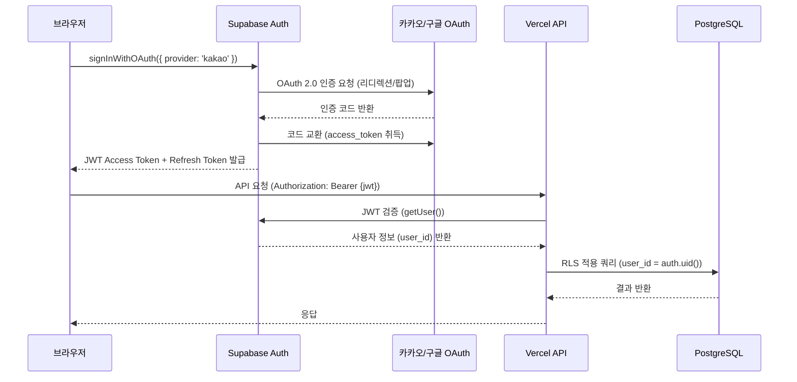
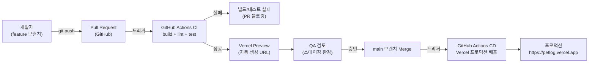
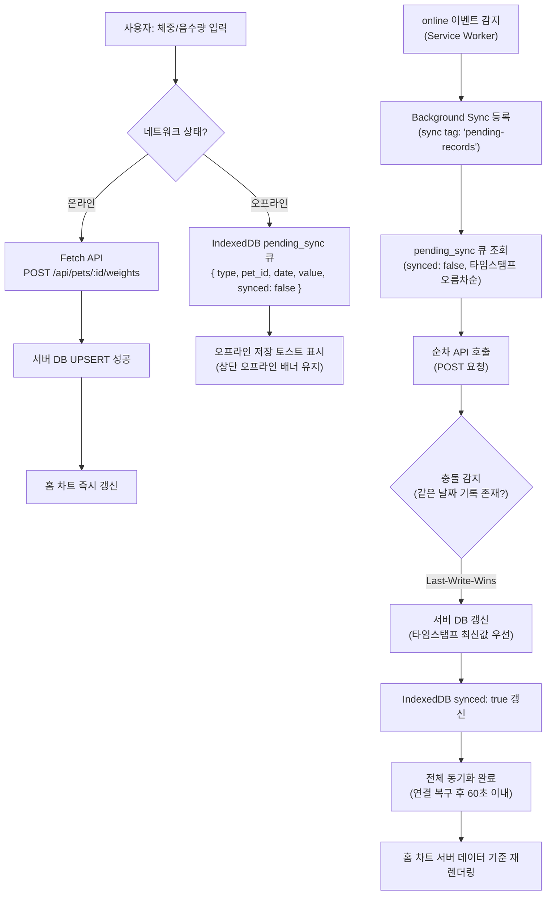

# 인프라아키텍처

**프로젝트명**: 반려동물 건강 기록 웹앱
**작성일**: 2026-06-22
**버전**: v1.0
**참조 문서**: 화면설계서.md, 시스템정의서.md, API스펙.md

---

## 1. 개요

### 1.1 목적

본 문서는 반려동물 건강 기록 웹앱(펫로그)의 인프라 구성, 컴포넌트 간 연계 방식, 배포 파이프라인, 보안 정책, 오프라인 지원 구조를 정의한다. 개발팀 및 운영팀이 시스템 전체 구조를 공유된 기준으로 이해하고 운영·확장할 수 있도록 하는 데 목적이 있다.

### 1.2 범위

| 구분 | 포함 내용 |
|------|-----------|
| 클라이언트 | React PWA, Service Worker, IndexedDB |
| 서버(Serverless) | Vercel Serverless Functions (Express.js), Vercel Cron Jobs |
| 데이터 계층 | Supabase PostgreSQL (RLS), Supabase Storage |
| 인증 | Supabase Auth (카카오·구글 OAuth 2.0) |
| 알림 | Web Push API (VAPID), FCM 호환 |
| CI/CD | GitHub Actions + Vercel 자동 배포 |
| CDN | Vercel Edge Network (정적 에셋) |

### 1.3 전제조건

| 항목 | 내용 |
|------|------|
| 앱스토어 배포 없음 | 브라우저 기반 PWA 단독 제공. iOS에서는 Safari 홈 화면 추가 방식 안내 |
| 단일 배포 플랫폼 | 프론트엔드 정적 빌드와 백엔드 API를 Vercel에서 통합 배포 |
| BaaS 의존 | 인증·DB·스토리지·RLS를 Supabase에 위임하여 자체 서버 운영 최소화 |
| 전 구간 HTTPS | TLS 1.2 이상, HTTP 요청은 자동 리디렉션 |
| Vercel Function 타임아웃 | 기본 10초. PDF 생성 함수에 한해 maxDuration 60초 적용 |

---

## 2. 전체 인프라 아키텍처

### 2.1 전체 레이어 다이어그램

```mermaid
graph TB
    subgraph CLIENT["클라이언트 레이어 (Browser / PWA)"]
        UI["React 18 + Vite SPA\n(React Router, Recharts)"]
        SW["Service Worker\n(Workbox - 캐싱 / Background Sync / Push)"]
        IDB["IndexedDB\n(pending_sync 큐)"]
        UI <-->|fetch intercept| SW
        SW <-->|오프라인 큐 R/W| IDB
    end

    subgraph VERCEL["Vercel 플랫폼"]
        EDGE["Vercel Edge Network\n(CDN - 정적 에셋 / 글로벌 PoP)"]
        FN["Express.js API\n(Vercel Serverless Functions /api/*)"]
        CRON["Vercel Cron Jobs\n(매일 리마인더 / 매월 1일 리포트)"]
        PDF["PDF Generator\n(html2pdf / Puppeteer\nmaxDuration 60s)"]
        EDGE -->|정적 파일 서빙| UI
        CRON -->|내부 HTTP 호출| FN
        FN -->|서버사이드 렌더링| PDF
    end

    subgraph SUPABASE["Supabase 플랫폼"]
        AUTH["Supabase Auth\n(OAuth 2.0 - 카카오·구글)"]
        DB[("PostgreSQL\n(RLS 전 테이블 적용)")]
        STORAGE["Supabase Storage\n(반려동물 사진 JPG/PNG)"]
        AUTH -->|세션 동기화| DB
    end

    subgraph EXTERNAL["외부 서비스"]
        KAKAO["Kakao OAuth\n(Kakao Developers)"]
        GOOGLE["Google OAuth\n(Google Cloud Console)"]
        PUSH_SVC["Web Push Service\n(FCM / Mozilla Push)"]
    end

    UI -->|HTTPS REST + JWT| FN
    UI -->|OAuth 팝업/리디렉션| AUTH
    AUTH -->|JWT 발급 반환| UI
    AUTH <-->|OAuth 위임| KAKAO
    AUTH <-->|OAuth 위임| GOOGLE
    FN -->|SQL (RLS 적용)| DB
    FN -->|파일 업로드/URL 조회| STORAGE
    FN -->|VAPID 서명 발송| PUSH_SVC
    PUSH_SVC -->|Web Push 알림| CLIENT
    EDGE -->|CDN 캐시 제공| CLIENT
```

### 2.2 요청 흐름 요약

| 요청 유형 | 경로 |
|-----------|------|
| 정적 에셋 (JS/CSS/이미지) | 브라우저 -> Vercel Edge CDN -> 클라이언트 |
| 로그인 | 브라우저 -> Supabase Auth -> 카카오/구글 OAuth -> JWT 반환 |
| API 요청 (인증 후) | 브라우저 -> Vercel Serverless Function -> Supabase DB (RLS) |
| 오프라인 기록 | 브라우저 -> Service Worker -> IndexedDB -> (온라인 복구 시) Background Sync |
| 알림 발송 | Vercel Cron -> Serverless Function -> Web Push Service -> 기기 |
| PDF 생성 | 브라우저 -> Serverless Function (maxDuration 60s) -> Supabase Storage -> 다운로드 URL |

---

## 3. 컴포넌트별 상세 설명

### 3.1 프론트엔드 (React PWA)

| 항목 | 내용 |
|------|------|
| 프레임워크 | React 18 + Vite |
| 라우팅 | React Router v6 (클라이언트 사이드 라우팅) |
| 차트 | Recharts (LineChart — 체중/음수량 추이) |
| HTTP 클라이언트 | Fetch API (Supabase JS SDK 내장) |
| 상태 관리 | React Context + useState (MVP 범위) |
| 빌드 출력 | 정적 파일 (HTML/JS/CSS) — Vercel Edge CDN 서빙 |
| PWA 설정 | `manifest.json` (display: standalone, 아이콘 세트) + Service Worker 등록 |

**PWA 지원 화면 범위**

| 화면 | 오프라인 접근 | 캐싱 전략 |
|------|--------------|-----------|
| 홈 (/) | 지원 | Cache First (Service Worker) |
| 체중 기록 입력 (/record/weight) | 지원 | Cache First |
| 음수량 기록 입력 (/record/water) | 지원 | Cache First |
| 리포트 목록·상세 (/reports/*) | 미지원 (온라인 필요) | Network First |
| 설정·마이페이지 | 읽기만 지원 | Cache First |

#### Service Worker 역할

| 역할 | 동작 |
|------|------|
| 정적 에셋 캐싱 | 설치(install) 단계에서 앱 셸(HTML/JS/CSS) 사전 캐시 |
| 오프라인 감지 | `online` / `offline` 이벤트 구독 -> 상단 배너 표시 연계 |
| Background Sync | `online` 이벤트 감지 시 IndexedDB `pending_sync` 큐 처리 |
| Push 수신 | `push` 이벤트 처리 -> 알림 표시 (`showNotification`) |
| Push 클릭 | `notificationclick` 이벤트 처리 -> 앱 포커스 또는 관련 화면 이동 |

#### IndexedDB 스키마

| 스토어 | 주요 필드 | 설명 |
|--------|-----------|------|
| `pending_sync` | `id`, `type` (weight/water), `pet_id`, `date`, `value`, `synced`, `created_at` | 오프라인 상태에서 저장된 기록 큐 |
| `cached_weights` | `pet_id`, `range`, `records`, `cached_at` | 차트 렌더링용 체중 데이터 로컬 캐시 |
| `cached_water_logs` | `pet_id`, `range`, `records`, `cached_at` | 차트 렌더링용 음수량 데이터 로컬 캐시 |

---

### 3.2 백엔드 (Vercel Serverless Functions)

| 항목 | 내용 |
|------|------|
| 런타임 | Node.js 20.x |
| 프레임워크 | Express.js (Vercel `/api` 라우트로 배포) |
| 진입점 | `api/index.js` — Express 앱을 Vercel Serverless Function으로 래핑 |
| 타임아웃 | 기본 10초. PDF 생성 함수(`api/pets/[id]/reports/export-pdf`)는 60초 |
| 인증 미들웨어 | JWT Bearer Token 검증 (`@supabase/supabase-js` `getUser()`) |
| DB 접근 | Supabase JS SDK (서버 측) — Service Role Key 사용 (Cron 전용), 일반 API는 사용자 JWT |

**API 라우트 구조**

| 경로 | 설명 |
|------|------|
| `POST /api/auth/social` | 소셜 로그인 (Supabase Auth 위임) |
| `DELETE /api/auth/me` | 회원 탈퇴 (소프트 삭제) |
| `POST/GET/PATCH/DELETE /api/pets/*` | 반려동물 프로필 CRUD |
| `POST/GET/PATCH/DELETE /api/pets/:id/weights/*` | 체중 기록 CRUD |
| `POST/GET/PATCH /api/pets/:id/water-logs/*` | 음수량 기록 CRU |
| `GET/POST /api/pets/:id/reports/*` | 월간 리포트 조회 + PDF 생성 |
| `POST/GET/PATCH /api/notifications/*` | 푸시 알림 구독 + 설정 관리 |
| `POST /api/cron/daily-reminder` | Vercel Cron 전용 — 리마인더 발송 |
| `POST /api/cron/monthly-report` | Vercel Cron 전용 — 월간 리포트 생성 |
| `POST /api/cron/purge-deleted-users` | Vercel Cron 전용 — 탈퇴 30일 경과 데이터 완전 삭제 |

**vercel.json Cron 설정**

| 작업 | cron 표현식 (UTC) | 실행 주기 |
|------|-------------------|-----------|
| 리마인더 알림 | `0 * * * *` | 매시 정각 (사용자 설정 시간 필터링) |
| 월간 리포트 생성 | `0 0 1 * *` | 매월 1일 00:00 UTC |
| 탈퇴 데이터 정리 | `0 2 * * *` | 매일 02:00 UTC |

---

### 3.3 데이터베이스 (Supabase PostgreSQL)

| 항목 | 내용 |
|------|------|
| 엔진 | PostgreSQL 15 (Supabase 관리형) |
| 연결 | Supabase JS SDK (클라이언트·서버) / PostgREST REST API |
| RLS | 전 테이블 적용 (`user_id = auth.uid()` 기반) |
| Connection Pooling | pgBouncer (Supabase 내장, Serverless 환경 연결 수 제어) |

**테이블 요약**

| 테이블 | 주요 컬럼 | RLS 조건 |
|--------|-----------|----------|
| `users` | `id` (UUID PK), `email`, `provider`, `created_at`, `deleted_at` | `id = auth.uid()` |
| `pets` | `id`, `user_id` (FK), `name`, `species`, `breed`, `birth_date`, `gender`, `neutered`, `photo_url` | `user_id = auth.uid()` |
| `weight_logs` | `id`, `pet_id` (FK), `user_id` (FK), `log_date`, `weight_kg` (NUMERIC 4,1) | `user_id = auth.uid()` |
| `water_logs` | `id`, `pet_id` (FK), `user_id` (FK), `log_date`, `amount_ml` (INTEGER) | `user_id = auth.uid()` |
| `monthly_reports` | `id`, `pet_id`, `user_id`, `year`, `month`, `avg_weight_kg`, `daily_weight_data` (JSONB), `anomaly_dates` (JSONB) | `user_id = auth.uid()` (INSERT: 서비스 롤 전용) |
| `user_settings` | `id`, `user_id` (UNIQUE FK), `reminder_time`, `reminder_enabled`, `water_bowl_capacity_ml` | `user_id = auth.uid()` |
| `push_subscriptions` | `id`, `user_id` (FK), `endpoint`, `p256dh`, `auth_key`, `is_active` | `user_id = auth.uid()` |

**인덱스 전략**

| 테이블 | 인덱스 | 목적 |
|--------|--------|------|
| `weight_logs` | `(pet_id, log_date)` UNIQUE | 당일 1건 제약 + 기간 조회 최적화 |
| `water_logs` | `(pet_id, log_date)` UNIQUE | 당일 1건 제약 + 기간 조회 최적화 |
| `monthly_reports` | `(pet_id, year, month)` UNIQUE | 월별 리포트 단건 조회 |
| `push_subscriptions` | `(user_id, is_active)` | 활성 구독 조회 최적화 |

---

### 3.4 인증 (Supabase Auth)

| 항목 | 내용 |
|------|------|
| 방식 | OAuth 2.0 소셜 로그인 (팝업 또는 리디렉션) |
| 제공자 | 카카오 (Kakao Developers 앱 키), 구글 (Google Cloud Console 클라이언트 ID) |
| 토큰 | JWT Access Token (7일 만료) + Refresh Token (Supabase 자동 갱신) |
| 저장 위치 | 브라우저 `localStorage` (CSP로 XSS 방어 보완) |
| SDK | `@supabase/supabase-js` — `supabase.auth.signInWithOAuth()` |

**인증 플로우**



---

### 3.5 스토리지 (Supabase Storage)

| 항목 | 내용 |
|------|------|
| 용도 | 반려동물 프로필 사진 저장 (JPG/PNG) |
| 버킷명 | `petlog-photos` |
| 접근 방식 | Supabase Storage API (`@supabase/supabase-js`) |
| URL 형식 | `https://<project>.supabase.co/storage/v1/object/public/petlog-photos/<path>` |
| 제한 | 파일 크기 최대 5MB, 형식 JPG/PNG |
| 무료 플랜 한도 | 1GB (MAU 5,000 목표 기준 충분) |
| CDN | Supabase Storage 내장 CDN — 이미지 URL 직접 서빙 |

**파일 경로 규칙**

| 유형 | 경로 | 예시 |
|------|------|------|
| 프로필 사진 | `pets/{user_id}/{pet_id}/profile.jpg` | `pets/abc123/def456/profile.jpg` |
| PDF 리포트 임시 파일 | `reports/{pet_id}/{year}-{month}.pdf` | `reports/def456/2026-05.pdf` |

---

### 3.6 푸시 알림 (Web Push VAPID)

| 항목 | 내용 |
|------|------|
| 방식 | Web Push API (VAPID 서명 방식) |
| 라이브러리 | `web-push` (서버측 Node.js) |
| Push Service | FCM (Chrome/Edge), Mozilla Push (Firefox), APNs Web Push (Safari 16+) |
| iOS 지원 | iOS 16.4+ Safari Web Push 지원. 미만 버전은 In-App 배너로 대체 |
| 구독 저장 | `push_subscriptions` 테이블 (`endpoint`, `p256dh`, `auth_key`) |

**푸시 알림 종류**

| 알림 유형 | 트리거 | 스케줄 |
|-----------|--------|--------|
| 기록 리마인더 | 사용자 설정 시간 도래 (기록 미완료 시) | Vercel Cron `0 * * * *` |
| 이상 징후 알림 | 체중 저장 후 비동기 임계값 검사 (7일 평균 대비 10% 이상 감소) | 실시간 (API 호출 후 비동기) |
| 월간 리포트 생성 알림 | 리포트 생성 완료 후 (매월 1일 오전 9~10시) | Vercel Cron `0 0 1 * *` |

**VAPID 키 관리**

| 키 | 저장 위치 | 용도 |
|----|-----------|------|
| `VAPID_PUBLIC_KEY` | 클라이언트 환경 변수 (공개) | Service Worker 구독 요청 시 사용 |
| `VAPID_PRIVATE_KEY` | 서버 환경 변수 (비공개) | 메시지 서명 |
| `VAPID_SUBJECT` | 서버 환경 변수 | Push 서버 연락처 (`mailto:`) |

---

## 4. 배포 파이프라인

### 4.1 CI/CD 파이프라인 다이어그램



### 4.2 GitHub Actions 워크플로우 구성

**CI 워크플로우 (`.github/workflows/ci.yml`)**

| 단계 | 내용 |
|------|------|
| 트리거 | `pull_request` (모든 브랜치) |
| 환경 | Node.js 20.x |
| 1단계 | 의존성 설치 (`npm ci`) |
| 2단계 | 린트 (`npm run lint`) |
| 3단계 | 단위 테스트 (`npm run test`) |
| 4단계 | 프론트엔드 빌드 (`npm run build`) |
| 결과 | 성공 시 Vercel Preview 자동 배포 트리거 |

**CD 워크플로우 (`.github/workflows/cd.yml`)**

| 단계 | 내용 |
|------|------|
| 트리거 | `push` to `main` 브랜치 |
| 환경 | Node.js 20.x |
| 1단계 | 의존성 설치 (`npm ci`) |
| 2단계 | Vercel CLI 프로덕션 배포 (`vercel --prod`) |
| 시크릿 | `VERCEL_TOKEN`, `VERCEL_ORG_ID`, `VERCEL_PROJECT_ID` |

### 4.3 배포 환경 구성

| 환경 | 도메인 | 브랜치 | Supabase 프로젝트 | 용도 |
|------|--------|--------|------------------|------|
| 로컬 개발 | `http://localhost:5173` | feature/* | 개발 프로젝트 | 개발·단위 테스트 |
| 스테이징 (Preview) | Vercel 자동 생성 URL | develop / PR | 개발 프로젝트 | 통합 테스트·QA |
| 프로덕션 | `https://petlog.vercel.app` | main | 프로덕션 프로젝트 | 실서비스 운영 |

---

## 5. 환경 구성

### 5.1 환경 변수 목록

| 변수명 | 환경 | 노출 범위 | 설명 |
|--------|------|-----------|------|
| `VITE_SUPABASE_URL` | 전체 | 클라이언트 | Supabase 프로젝트 API URL |
| `VITE_SUPABASE_ANON_KEY` | 전체 | 클라이언트 | Supabase 익명 키 (공개 가능) |
| `VITE_VAPID_PUBLIC_KEY` | 전체 | 클라이언트 | Web Push VAPID 공개 키 |
| `SUPABASE_SERVICE_ROLE_KEY` | 서버 전용 | 서버 | Supabase 서비스 롤 키 (Cron 전용, 비공개) |
| `VAPID_PRIVATE_KEY` | 서버 전용 | 서버 | Web Push VAPID 비공개 키 |
| `VAPID_SUBJECT` | 서버 전용 | 서버 | Push 서버 연락처 (`mailto:admin@petlog.app`) |
| `VERCEL_TOKEN` | CI/CD | GitHub Actions | Vercel 배포 인증 토큰 |

### 5.2 로컬 개발 환경 구성

```
프로젝트 루트/
├── .env.local          # 로컬 전용 환경 변수 (gitignore 처리)
├── src/                # 프론트엔드 소스
│   ├── frontend/
│   └── backend/
├── api/                # Express.js Serverless Functions
├── public/
│   ├── manifest.json   # PWA 매니페스트
│   └── sw.js           # Service Worker (Vite PWA 플러그인 생성)
├── vercel.json         # Vercel 배포 설정 (cron, routes, headers)
└── .github/workflows/  # CI/CD 워크플로우
```

**로컬 개발 구동 순서**

| 단계 | 명령 | 내용 |
|------|------|------|
| 1 | — | Supabase 개발 프로젝트 생성 및 `.env.local` 환경 변수 설정 |
| 2 | `npm install` | 의존성 설치 |
| 3 | `npx web-push generate-vapid-keys` | VAPID 키 생성 |
| 4 | `vercel dev` | Vite 개발 서버 (localhost:5173) + Vercel Dev 로컬 API 함수 동시 구동 |

---

## 6. 보안 아키텍처

### 6.1 인증 및 토큰 보안

| 항목 | 정책 |
|------|------|
| 로그인 방식 | Supabase Auth OAuth 2.0 (카카오, 구글) |
| Access Token | JWT, 7일 만료, `Authorization: Bearer` 헤더 전달 |
| Refresh Token | Supabase Auth 자동 관리. `onAuthStateChange`로 자동 갱신 |
| 토큰 저장 | 브라우저 `localStorage` (CSP로 XSS 방어 보완) |
| 로그아웃 | `supabase.auth.signOut()` + `localStorage` 토큰 삭제 |
| 세션 만료 | Refresh Token 만료 시 자동 로그아웃 + 안내 토스트 표시 |

### 6.2 Row-Level Security (RLS)

RLS는 Supabase PostgreSQL 레벨에서 SQL 정책으로 강제된다. Express.js API 레이어에서 사용자 JWT를 검증하더라도, DB 레이어에서 별도로 `user_id = auth.uid()` 정책이 적용되어 이중 보호를 제공한다.

| 테이블 | 허용 작업 | RLS 조건 |
|--------|-----------|----------|
| `users` | SELECT, UPDATE | `id = auth.uid()` |
| `pets` | SELECT, INSERT, UPDATE, DELETE | `user_id = auth.uid()` |
| `weight_logs` | SELECT, INSERT, UPDATE, DELETE | `user_id = auth.uid()` |
| `water_logs` | SELECT, INSERT, UPDATE, DELETE | `user_id = auth.uid()` |
| `monthly_reports` | SELECT (INSERT: 서비스 롤 전용) | `user_id = auth.uid()` |
| `user_settings` | SELECT, INSERT, UPDATE, DELETE | `user_id = auth.uid()` |
| `push_subscriptions` | SELECT, INSERT, UPDATE, DELETE | `user_id = auth.uid()` |

> Vercel Cron이 월간 리포트를 INSERT할 때는 `SUPABASE_SERVICE_ROLE_KEY`를 사용한다. 해당 키는 서버 환경 변수에만 보관하며 클라이언트에 노출하지 않는다.

### 6.3 전송 보안

| 항목 | 정책 |
|------|------|
| 프로토콜 | 전 구간 HTTPS (TLS 1.2+) 의무화 |
| HTTP 리디렉션 | Vercel 및 Supabase Edge에서 HTTP -> HTTPS 자동 리디렉션 |
| CORS | 허용 오리진을 프로덕션 도메인으로 제한 (`https://petlog.vercel.app`) |
| CSP 헤더 | `default-src 'self'`. Supabase API, Kakao/Google OAuth 도메인 허용 목록 등록 |
| VAPID 서명 | 서버 측 `VAPID_PRIVATE_KEY`로 Push 메시지 서명. 키는 서버 환경 변수에만 보관 |

### 6.4 데이터 보존 및 삭제 정책

| 이벤트 | 처리 방식 | 보존 기간 |
|--------|----------|----------|
| 회원 탈퇴 | `users.deleted_at` 소프트 삭제, Supabase Auth 계정 비활성화 | 30일 |
| 탈퇴 30일 경과 | Vercel Cron (`purge-deleted-users`) — CASCADE 완전 삭제 | 즉시 삭제 |
| 반려동물 프로필 삭제 | `weight_logs`, `water_logs`, `monthly_reports` CASCADE 삭제 | 즉시 삭제 |
| Supabase Storage 사진 | 프로필 삭제 API에서 명시적 Storage 파일 삭제 호출 | 즉시 삭제 |

---

## 7. 오프라인 아키텍처

### 7.1 캐싱 전략

| 리소스 유형 | 전략 | 설명 |
|-------------|------|------|
| 앱 셸 (HTML/JS/CSS) | Cache First | 설치 시 사전 캐시. 네트워크 불필요 |
| 반려동물 사진 (Supabase Storage) | Stale While Revalidate | 캐시 먼저 반환 후 백그라운드 갱신 |
| API 응답 (체중/음수량 목록) | Network First with Cache Fallback | 온라인 시 네트워크 우선. 오프라인 시 캐시 반환 |
| 리포트 API 응답 | Network Only | 오프라인 시 접근 불가 안내 |
| 웹 폰트 (Pretendard/Inter) | Cache First | 설치 시 사전 캐시 |

### 7.2 오프라인 기록 동기화 흐름



### 7.3 충돌 해소 정책 (Last-Write-Wins)

| 시나리오 | 처리 방식 |
|---------|----------|
| 오프라인 기록 vs 동일 날짜 서버 기록 | Last-Write-Wins: `created_at` 타임스탬프 최신값이 최종값으로 저장 |
| 여러 오프라인 기록 (같은 날짜 중복) | 타임스탬프 오름차순 처리. 마지막 값이 최종 저장 |
| 동기화 API 호출 실패 | 해당 기록 `synced: false` 유지. 다음 Background Sync 시 재시도 |

---

## 8. 확장성 고려

### 8.1 Vercel 자동 스케일링

| 항목 | 내용 |
|------|------|
| Serverless 자동 확장 | Vercel Serverless Functions는 요청 수에 따라 자동 스케일아웃. 별도 서버 프로비저닝 불필요 |
| 글로벌 CDN | Vercel Edge Network — 전세계 PoP에서 정적 에셋 서빙. LCP 목표 2.5초 달성 기반 |
| Cold Start 대응 | Express.js 단일 진입점으로 Function 번들 최소화. Node.js 런타임 Cold Start 영향 최소화 |
| 동시 요청 | Vercel Hobby 플랜도 MVP 범위 MAU 5,000 대응 가능. 트래픽 증가 시 Pro 플랜 전환 |

### 8.2 Supabase Connection Pooling

| 항목 | 내용 |
|------|------|
| 도구 | pgBouncer (Supabase 내장) |
| 모드 | Transaction 모드 (Serverless 환경에 적합 — 요청별 연결 반환) |
| 연결 문자열 | Pooler URL (포트 6543) 사용. 직접 연결(포트 5432)은 장기 연결 클라이언트 전용 |
| 설정 기준 | MAU 5,000 기준 동시 Serverless Function 인스턴스 수 대비 `pool_size` 조정 필요 |

### 8.3 MAU 증가 시 확장 경로

| MAU 단계 | 조치 |
|----------|------|
| ~5,000 | Supabase 무료 플랜 + Vercel Hobby 플랜 운영 가능 |
| 5,000~20,000 | Supabase Pro 플랜 전환 (DB 8GB, Storage 100GB). Vercel Pro 플랜 검토 |
| 20,000+ | Supabase Read Replica 추가, CDN 이미지 최적화, API 응답 캐싱 레이어 (Redis) 도입 검토 |

### 8.4 성능 목표 및 구현 대응

| NFR ID | 지표 | 목표 | 구현 방안 |
|--------|------|------|-----------|
| NFR-001 | 기록 저장 응답 | 95th percentile ≤ 1초 | Supabase 단일 UPSERT + 복합 인덱스 `(pet_id, log_date)` + Vercel Edge 배포 |
| NFR-002 | LCP | ≤ 2.5초 (4G 기준) | Vite 코드 스플리팅 (동적 import) + 이미지 lazy load + Service Worker Cache First |
| NFR-003 | PDF 생성 | ≤ 5초 | 서버사이드 html2pdf + Vercel Function maxDuration 60초 + 생성 중 로딩 오버레이 |
| NFR-011 | 서비스 가동률 | ≥ 99.5% (월간) | Vercel 글로벌 CDN + Serverless 자동 확장 + Supabase HA 구성 |

---

**작성 완료 여부**: [x] 인프라아키텍처 작성 완료 (2026-06-22)
