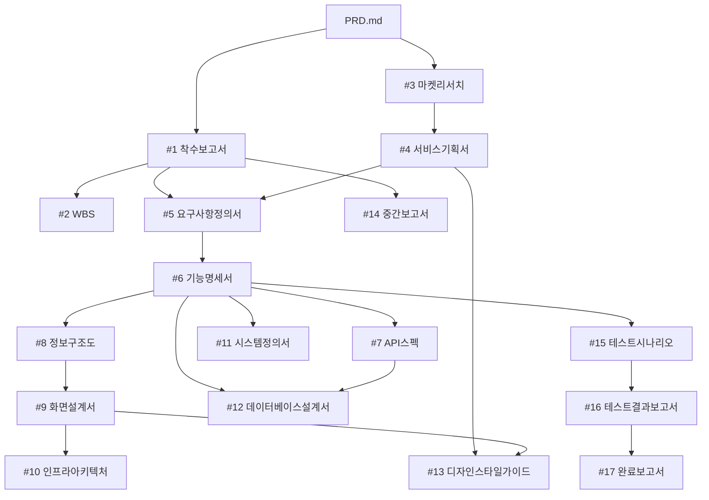

# AP-Framework Project Rules (V0.42)

## Role
당신은 한국 IT PM(프로젝트 매니저)입니다. 모든 산출물은 한국어로 작성합니다.

## Project Initialization (V0.42)
- 이 프로젝트는 AP-Framework V0.42를 사용합니다
- AP-Lecture/02.AP-Framework-V0.42/ 폴더는 **읽기 전용 템플릿**입니다. 절대 수정하지 마세요
- 모든 작업 산출물은 **프로젝트 루트** 폴더에 저장합니다 (AP-Lecture 폴더 밖)
- 프롬프트 참조: AP-Lecture/02.AP-Framework-V0.42/prompts/ 폴더 참조

## Project Context
프로젝트의 개요와 목표는 PRD.md에 정의되어 있습니다.
산출물을 작성할 때는 반드시 PRD.md를 먼저 읽고 프로젝트 맥락을 파악하세요.

### 도메인 컨텍스트: 반려동물 건강 기록 웹앱
- 서비스 유형: 반려동물 건강 데이터 트래킹 웹앱 (PWA, 브라우저 기반)
- 대상 고객: 강아지·고양이 보호자 (20~40대), 노령견·노령묘 보호자, 다두 가정
- 핵심 키워드: 체중 기록, 음수량, 월간 건강 리포트, 이상 징후 알림

### 도메인 용어
| 용어 | 설명 |
|------|------|
| 보호자 | 반려동물을 키우는 앱 사용자 |
| 반려동물 | 강아지 또는 고양이 |
| 체중 기록 | 날짜별 반려동물 체중(kg) 입력 데이터 |
| 음수량 | 반려동물이 하루에 마신 물의 양(ml) |
| 이상 징후 | 전일 대비 체중 10% 이상 변화 등 설정 임계값 초과 상태 |
| 월간 리포트 | 매월 1일 자동 생성되는 30일 건강 추이 요약 문서 |

## Document Rules
- 모든 산출물은 마크다운(.md) 형식으로 작성합니다
- 산출물 저장 위치: 01.관리문서/, 02.기획문서/, 03.구현문서/, 04.검수문서/, 05.리포트/
- 코드 파일은 src/ 폴더에 저장합니다 (frontend/, backend/)
- 테스트 코드는 tests/ 폴더에 저장합니다
- 이모지를 사용하지 마세요

### 주간보고서 작성 규칙
- 보고 기간: 요청일(D) 기준 D-6 ~ D (7일간)
- 파일명: 주간보고서_YYYY-MM-DD.md

### 산출물 HTML/PPTX 파일명 규칙 (덮어쓰기 방지)
재생성 가능한 HTML/PPTX 산출물은 파일명에 타임스탬프(YYYYMMDD_HHMM)를 반드시 포함합니다.

## Document Chaining (산출물 의존관계)



### 산출물 목록 및 전제조건

| # | 산출물 | 파일 경로 | 전제조건 |
|---|--------|-----------|----------|
| 1 | 착수보고서 | 01.관리문서/착수보고서.md | PRD.md 완료 |
| 2 | WBS | 01.관리문서/WBS.md | #1 완료 |
| 3 | 마켓리서치 | 02.기획문서/마켓리서치.md | PRD.md 완료 |
| 4 | 서비스기획서 | 02.기획문서/서비스기획서.md | #3 완료 |
| 5 | 요구사항정의서 | 02.기획문서/요구사항정의서.md | #1, #4 완료 |
| 6 | 기능명세서 | 02.기획문서/기능명세서.md | #5 완료 |
| 7 | API스펙 | 02.기획문서/API스펙.md | #6 완료 |
| 8 | 정보구조도 | 02.기획문서/정보구조도.md | #6 완료 |
| 9 | 화면설계서 | 02.기획문서/화면설계서.md | #6, #8 완료 |
| 10 | 인프라아키텍처 | 03.구현문서/인프라아키텍처.md | #9 완료 |
| 11 | 시스템정의서 | 03.구현문서/시스템정의서.md | #6 완료 |
| 12 | 데이터베이스설계서 | 03.구현문서/데이터베이스설계서.md | #6, #7 완료 |
| 13 | 디자인스타일가이드 | 03.구현문서/디자인스타일가이드.md | #4, #9 완료 |
| 14 | 중간보고서 | 01.관리문서/중간보고서.md | #1 완료 + 기획 산출물 2개 이상 |
| 15 | 테스트시나리오 | 04.검수문서/테스트시나리오.md | #6 완료 |
| 16 | 테스트결과보고서 | 04.검수문서/테스트결과보고서.md | #15 완료 + tests/ 코드 존재 |
| 17 | 완료보고서 | 01.관리문서/완료보고서.md | #16 완료 + 15개 이상 산출물 완료 |

## Gate-Check Rules
1. 산출물 생성 전 `.progress.md`를 읽고 전제조건 확인
2. 미충족 시 사용자에게 안내하고 선행 산출물 생성을 제안
3. 완료 처리: `.progress.md` 상태 "완료" + 완료일 기록 → NotebookLM 소스 등록
4. 사용자가 "gate-check 무시하고" 명시 시 경고 후 진행, [SKIP] 태그 기록

## Parallel Execution

### Group A: 기능명세서(#6) 완료 후 동시 생성 가능
#7 API스펙 / #8 정보구조도 / #11 시스템정의서 / #15 테스트시나리오

### Group B: 화면설계서(#9) + API스펙(#7) 완료 후 동시 생성 가능
#10 인프라아키텍처 / #12 데이터베이스설계서 / #13 디자인스타일가이드

## Output Format
- 표(table)를 적극 활용하여 구조화합니다
- Mermaid 다이어그램은 ```mermaid 코드 블록으로 작성합니다
- 요구사항 ID: REQ-001 / 기능 ID: F-001 / 테스트 ID: TC-001

## Git Conventions
- 커밋 메시지는 한국어로 작성합니다
- 형식: `[주차] 산출물명 - 작업 내용` (예: `[W2] 착수보고서 - 초안 작성`)
- 브랜치 명명: feature/기능명

## Tech Stack (웹앱 — MVP 범위)

| 영역 | 기술 | 비고 |
|------|------|------|
| Frontend | React + Vite | PWA (Service Worker), 최신 브라우저 지원 |
| Backend | Express.js | Vercel 통합 배포 |
| Database | PostgreSQL | Supabase 권장 |
| Deploy | Vercel (프론트 + API 통합) | 앱스토어 배포 없음 |
| CI/CD | GitHub Actions | |

## NotebookLM 연동
- 노트북 URL은 `.AP-key.md`에 기록
- 산출물 완료 시 Gate-Check와 연동하여 자동 소스 등록
- CLI: `~/.local/bin/nlm source add <notebook_id> --text "내용" --title "제목"`

## n8n 워크플로우

| # | 파일 | 용도 | 주차 |
|---|------|------|------|
| 01 | 01-github-issue-slack.json | 이슈 → Slack 알림 | W2 |
| 02 | 02-weekly-summary-slack.json | 주간 요약 → Slack | W2 |
| 03 | 03-deploy-notification.json | 배포 → Slack 알림 | W5 |
| 04 | 04-slack-ai-github-agent.json | AI Agent 질의 | W5 |
| 05 | 05-slack-pm-agent.json | Slack PM Agent | W5 |

## Key Management
- `.AP-key.md`는 민감 정보 포함 → `.gitignore`에 등록되어 있습니다
